# Docker Swarm & Microservices

## Docker Swarm & Microservices

-   Buat 3 server untuk 1 manager dan 2 worker

    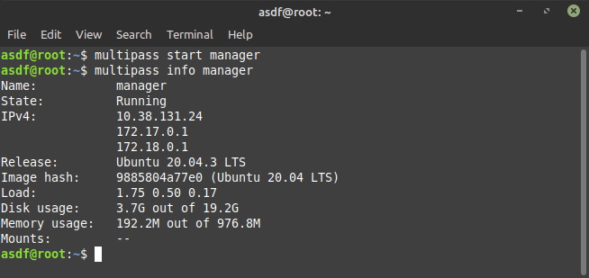

    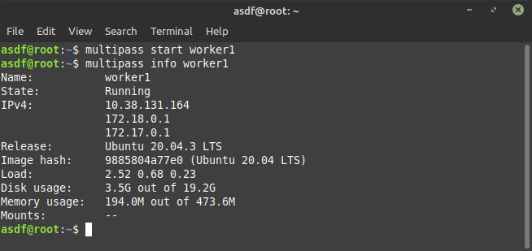

    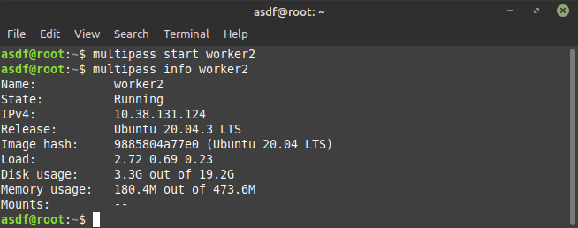

-   Install docker menggunakan ansible.

    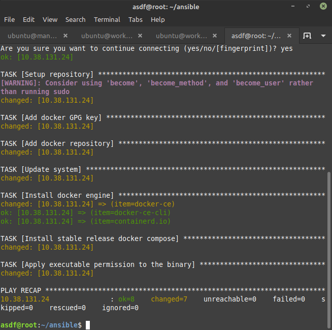

    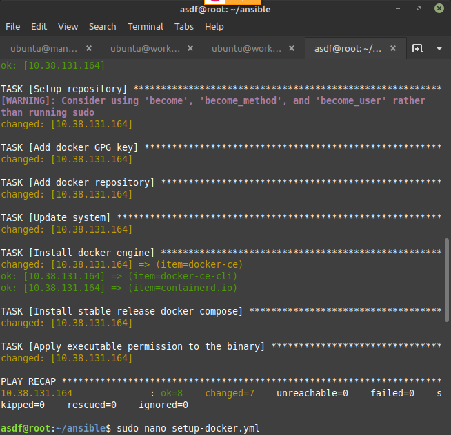

    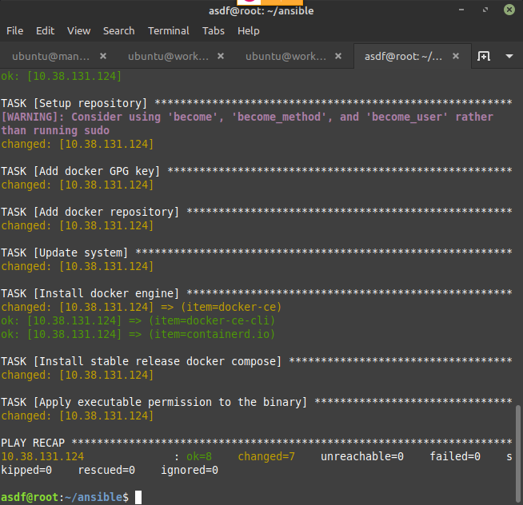    

-   Setup Docker Swarm.
    Perintah init untuk docker swarm
    ```sh
    docker swarm init --advertise-addr IPservermanagar
    ```
    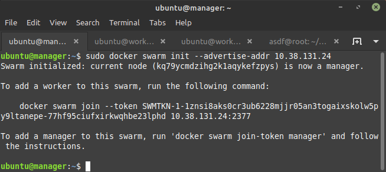

-   Join tiap worker ke docker swarm.

    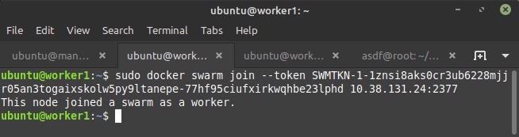

    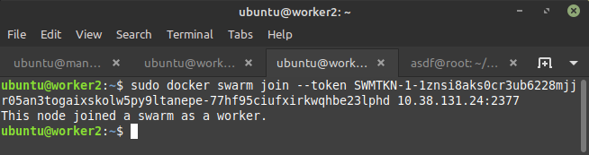

-   Untuk memastikan server worker telah terdaftar di docker swarm lakukan dengan perintah.
    ```sh
    sudo docker node ls
    ```
    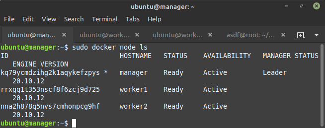

-   Clone repository.
    ```sh
    git clone https://github.com/sgnd/dumbways-microservices.git
    ```
    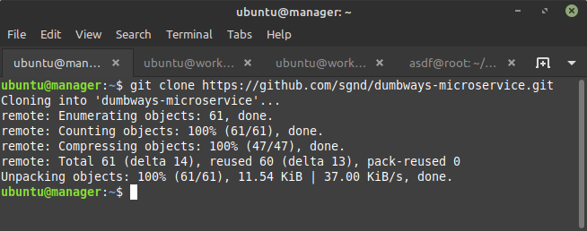    

-   Buat images dan deploy.

    perintah build
    ```sh
    docker-compose build
    ```
    perintah deploy
    ```sh
    docker stack deploy --compose-file docker-compose.yml stack-apps
    ```
    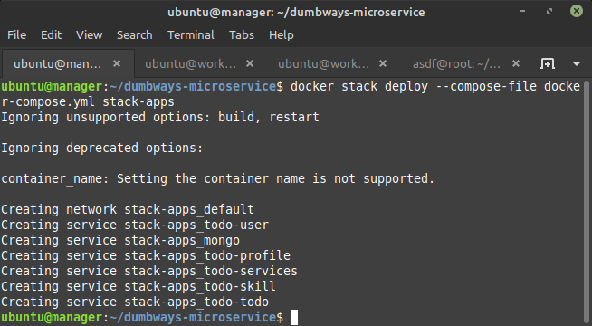

-   Replicate dari salah satu container.
    ```sh
    docker service scale IdContainer=JumlahReplica
    ```
    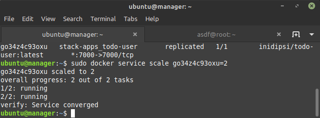

-   Akses web browser dengan AlamatIp>:Port.

    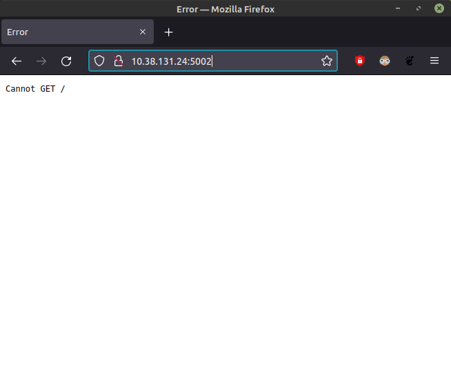
