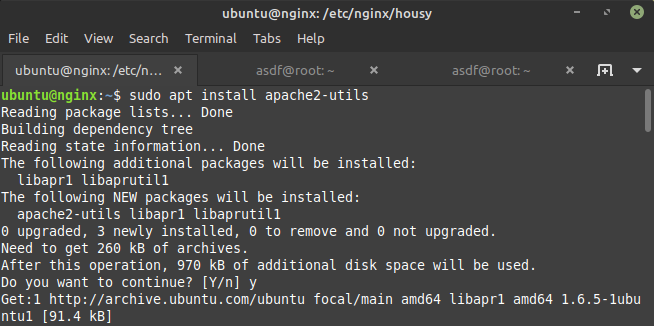
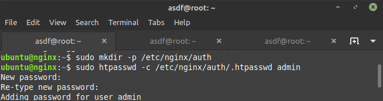
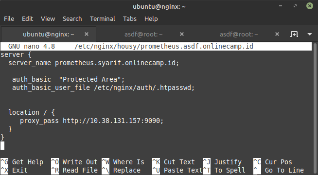
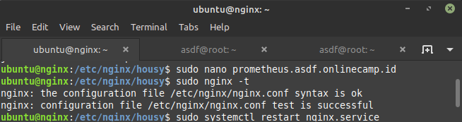
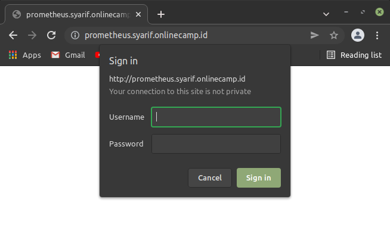

# Auth

## AUTH

-   Install apache2-utils di server Nginx

    

-   Buat direktori untuk menyimpan file password yang dibuat. Lalu buat password untuk user admin (bisa disesuaikan).

    

-   Tambahkan rules authencation di file config reverse proxy.

    

-   Test konfig `sudo nginx -t` restart nginx `sudo systemctl restart nginx`.

    

-   lalu akses domain dengan browser.

    
