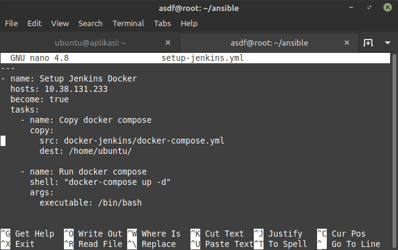
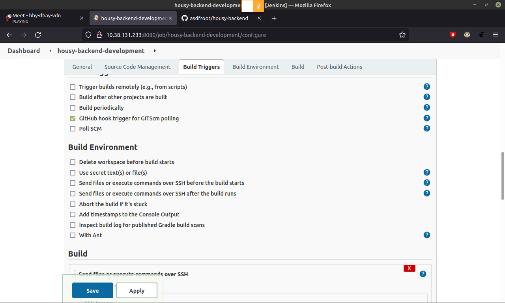

# CI/CD

## CI/CD

-   Melakukan proses instalasi jenkins dengan menggunakan docker di ansible kemudian jalankan dengan menggunakan `ansible-playbook` pada `setup-jenkins.yml`.

    docker-compose.yml

    

    setup-jenkins.yml

    

-   jika sudah bisa login, lalu install plugin Publish Over SSH

    

    Setup Publish over ssh

    

-   Setup jenkins job

    Buat `freestyle project`, `Configure`, setup `source code management`

    

    Setup build triggers

    

    Setup build, dan `save`

    

    Test build

    

-   Setup GitHub Webhook

    Buka repository app Settings Masuk ke Webhook Tambahkan domain jenkins di Payload Url

    

    coba lakukan perubahan direpository dan push kemudian cek apakah ada build terbaru terdeteksi oleh jenkins

    
