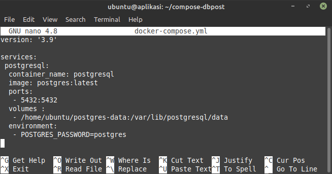
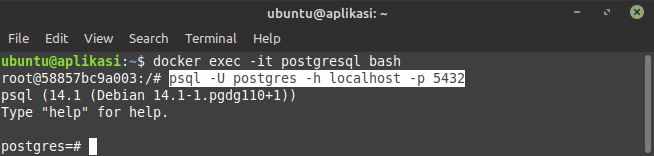
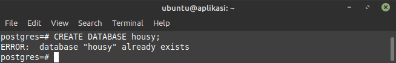
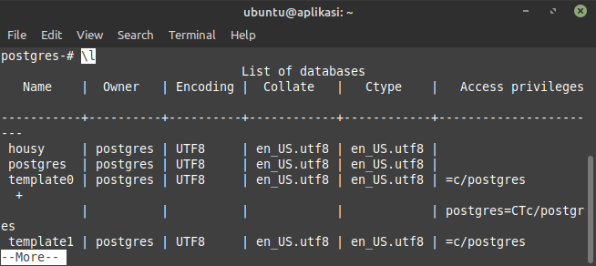
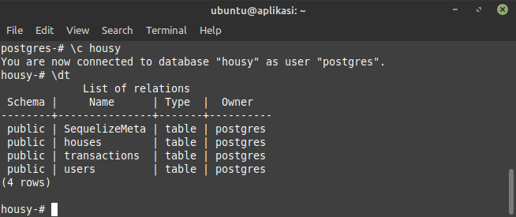

# Database

## DATABASE

-   Membuat `docker-compose.yml` untuk postgres

    

-   Menjalankan konfigurasi `docker-compose.yml`
    ```sh
    docker-compose up -d
    ```
-   Kemudian masuk ke Bash Docker di image postgres dengan command:
    ```sh
    sudo docker exec -it postgresql bash
    ```
-   Lalu masuk ke PostgreSQL Prompt dengan command:
    ```sh
    psql -U postgres -h localhost -p 5432
    ```
    

-   Selanjutnya membuat Database baru untuk `housy` dengan command
    ```sh
    CREATE DATABASE housy;
    ```
    

    

-   Melihat Database `housy` dengan command
    ```sh
    \c housy;
    ```
-   Melihat Table dari Database `housy`
    ```sh
     \dt
    ```
    
