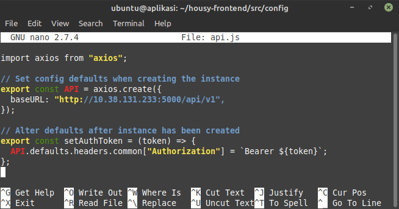
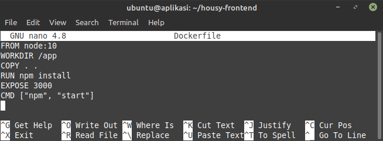
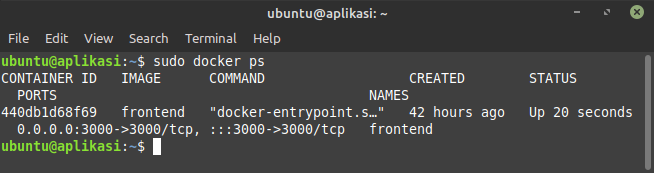
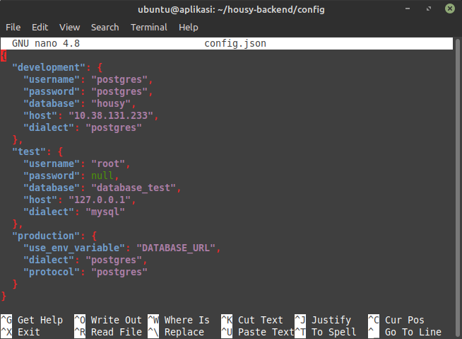
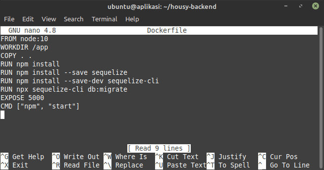
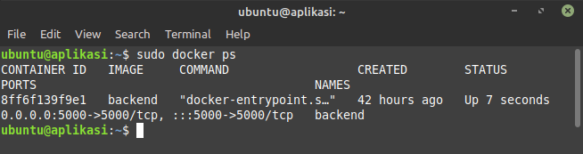

# Deployment

## DEPLOYMENT

-   Frontend

    edit config frontend dan arahkan ke backend
    ```sh
    sudo nano /haousy-frontend/src/config/api.js
    ```
    

    Membuat `Dockerfile` frontend
    ```sh
    sudo nano /haousy-frontend/Dockerfile
    ```
    

    Build aplikasi frontend
    ```sh
    sudo docker build -t frontend .
    ```
    Run aplikasi frontend
    ```sh
    sudo docker run -itd -p 3000:3000 --name frontend frontend
    ```
    

-   Backend

    edit config backend dan arahkan ke postgres
    ```sh
    sudo nano /haousy-backend/config/config.json
    ```
    

    Membuat `Dockerfile` backend dan migrate ke database
    ```sh
    sudo nano /haousy-backend/Dockerfile
    ```
    

    Build aplikasi backend
    ```sh
    sudo docker build -t backend .
    ```
    Run aplikasi backend
    ```sh
    sudo docker run -itd -p 5000:5000 --name backend backend
    ```
    
