# Repository

## Clone Housy frontend dan backend repository

-   Clone app Housy frontend dari repository
    ```sh
    git clone https://github.com/asdfroot/housy-frontend.git
    ```
    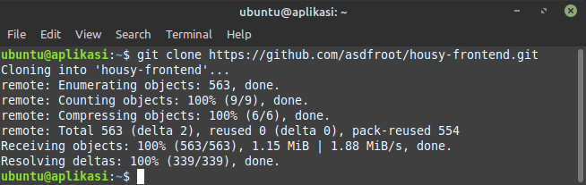

-   Clone app Housy backend dari repository
    ```sh
    git clone https://github.com/asdfroot/housy-backend.git
    ```
    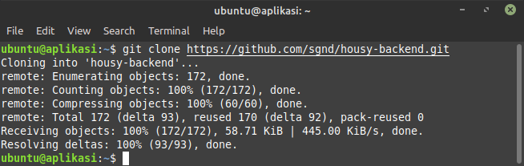    

-   Membuat Repository sendiri untuk housy-frontend dan housy-backend

    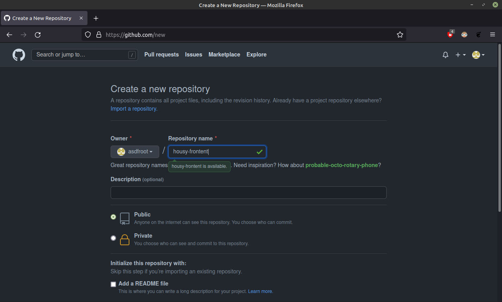

-   Membuat branch
    ```sh
    git branch development
    ```
    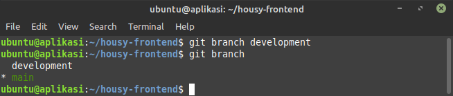
-   Pindah branch development
    ```sh
    git checkout development
    ```
    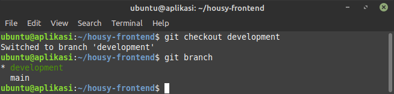

-   Coba melakukan commit
    ```sh
    git add .
    ```
    ```sh
    git commit -m "pesan"
    ```
    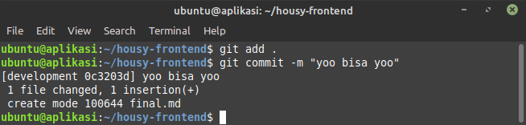

-   Coba melalukan push
    ```sh
    git push git@github.com:asdfroot/dumbflix-backend.git
    ```
    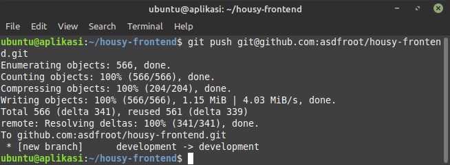

-   Membuat branch
    ```sh
    git branch production
    ```
    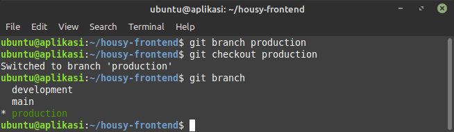
-   Pindah branch productiont
    ```sh
    git checkout production
    ```
    

-   Coba melakukan commit
    ```sh
    git add .
    ```
    ```sh
    git commit -m "pesan"
    ```
    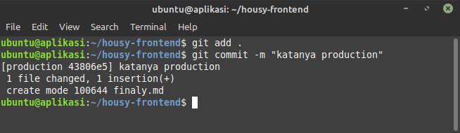

-   Coba melalukan push
    ```sh
    git push git@github.com:asdfroot/dumbflix-backend.git
    ```
    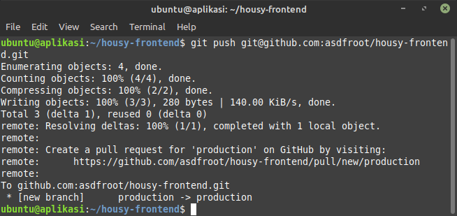

-   Cek perubahan pada Repository

    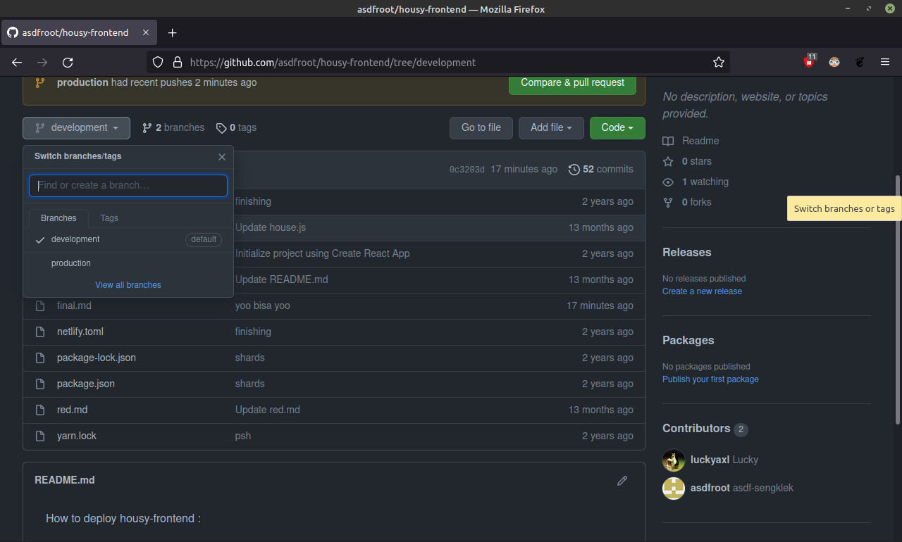
