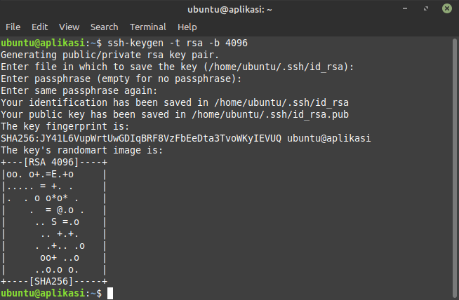
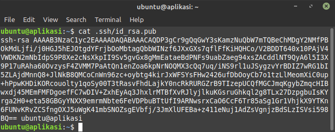
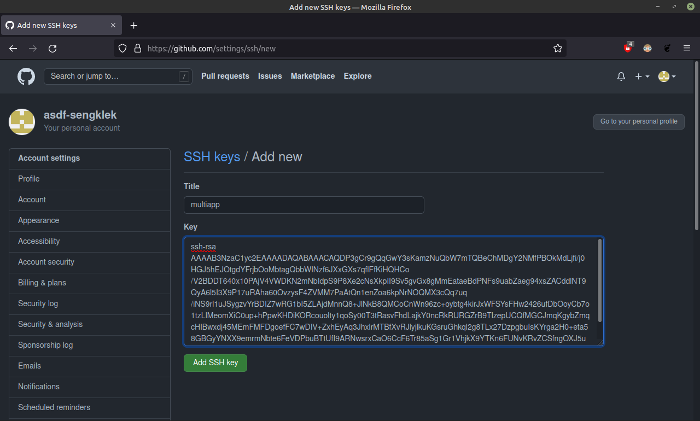
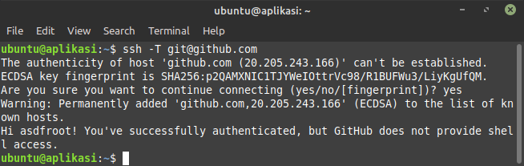

# SSH

## SSH

-   Lakukan generate ssh-keygen

    

-   Buka id_rsa.pub lalu copy
    ```sh
    cat .ssh/id_rsa.pub
    ```
    

-   Buka akun github dan pastekan id_rsa.pub yang sudah di copy

    

-   Selanjutnya autentikasi SSH ke github

    
