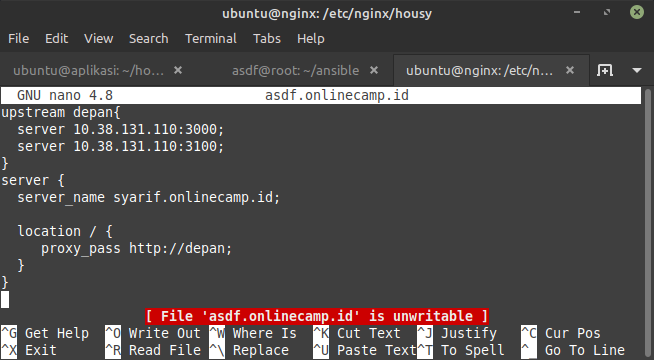
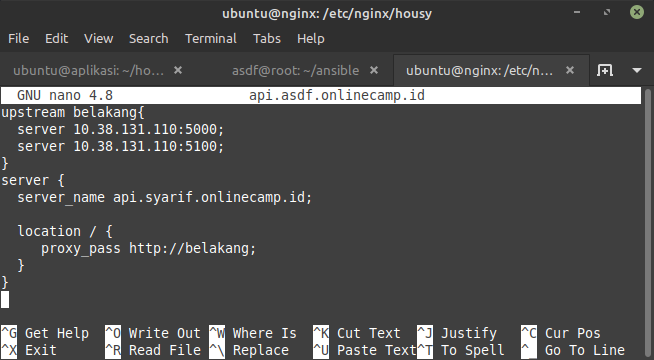

# Server

## Membuat 3 server dimultipass

-   Server Nginx
    ```sh
    multipass launch -c 1 -m 512M -d 8G -n nginx
    ```
-   Server Monitoring
    ```sh
    multipass launch --name monitor --disk 10G
    ```
-   Server Frontend, Backend. Database, CI/CD
    ```sh
    multipass launch --name aplikasi --disk 20G
    ```
    

## Load balancing (Frontend and Backend)

-   Login ke server Nginx, lalu masuk ke `/etc/nginx` dan edit file config frontend

    

-   jika config frontend sudah lakukan hal yang sama untuk config backend

    
