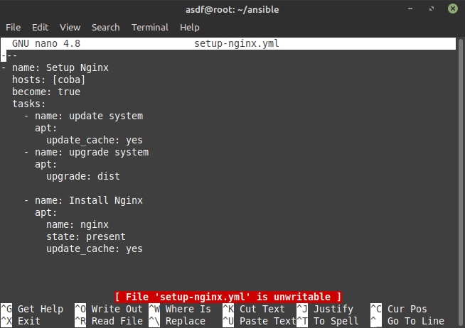
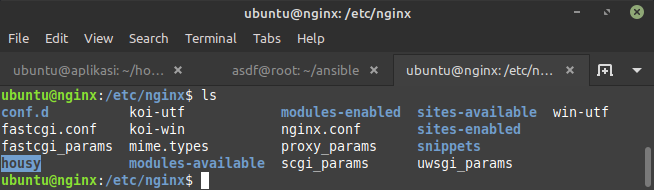
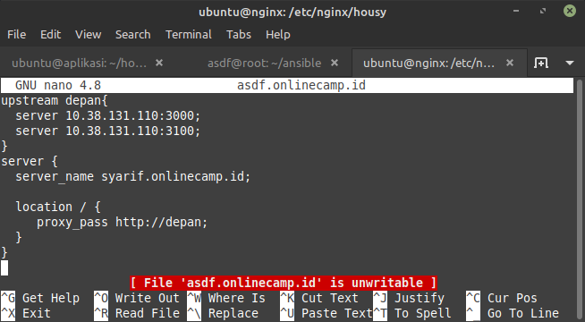
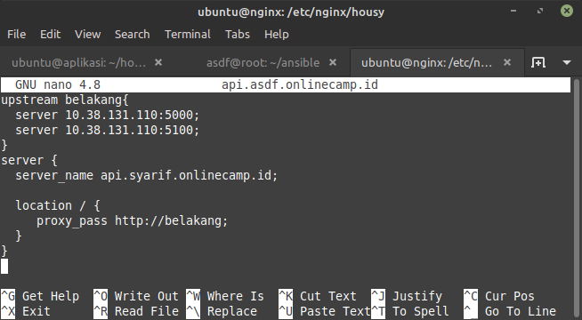
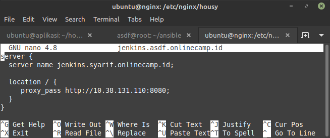
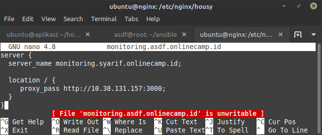
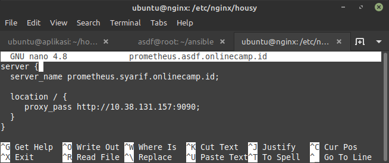
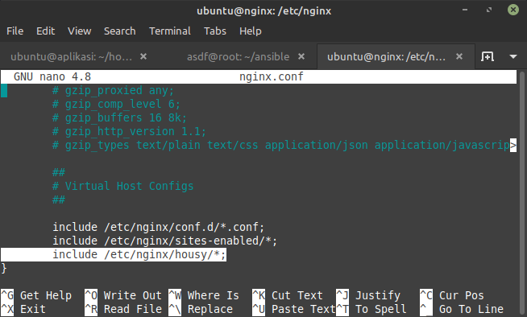
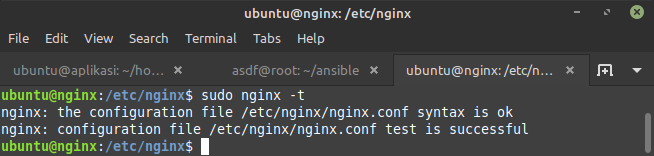
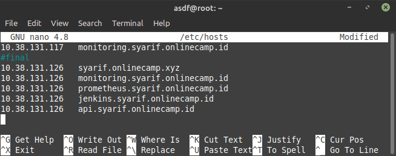

# Web Server

## WEB SERVER

-   Web server yang digunakan adalah Nginx, Instalasi menggunakan ansible.

    

    

-   Buat folder config dan simpan di /etc/nginx/housy

    

    Buat config frontend syarif.onlinecamp.id

    

    Buat config backend api.syarif.onlinecamp.id

    

    Buat config jenkins jenkins.syarif.onlinecamp.id

    

    Buat config monitoring monitoring.syarif.onlinecamp.id

    

    Buat config prometheus prometheus.syarif.onlinecamp.id

    

    Include folder konfig ke dalam `nginx.conf`

    1nxper

    Tes config nginx

    hostsloc

    Menambahkan domain pada local

    
