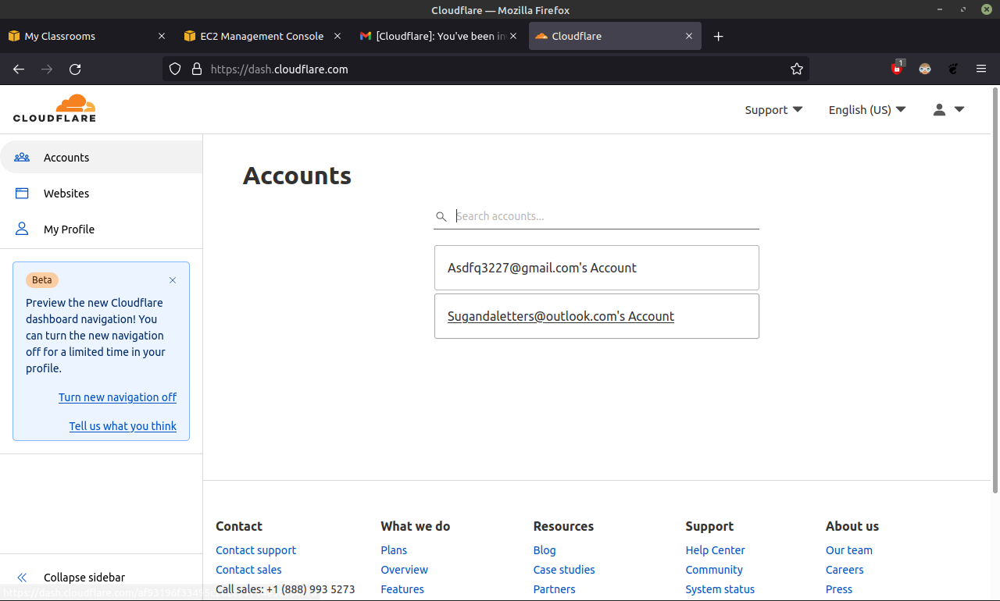
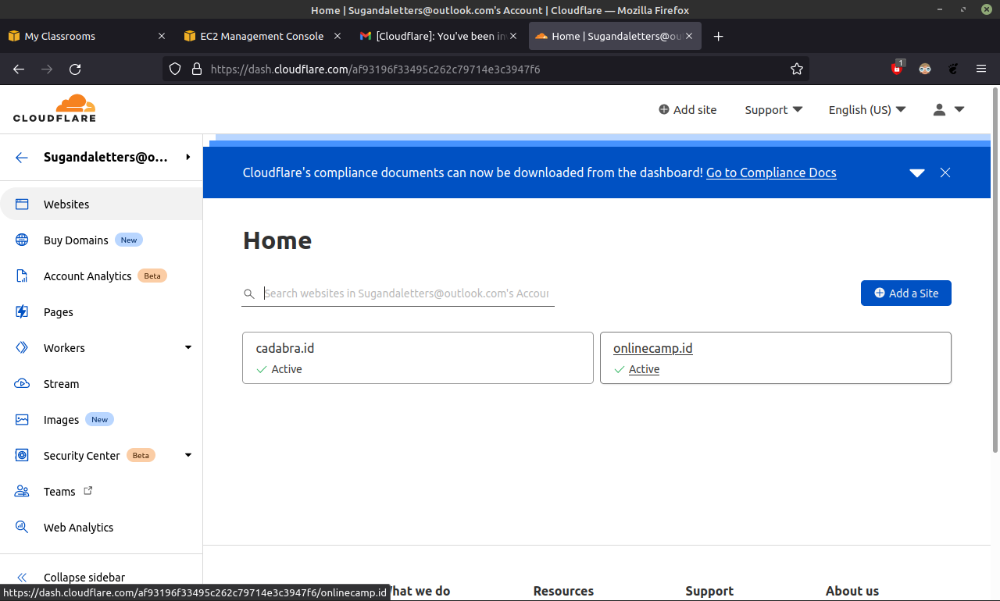

# AWS Custom Domain

## Custom Domain

-   Login **cloudflare** dan Invite email mentor.

    

-   Selanjutnya klik `onlinecamp.id`

    

-   Klik `Add record` isi **Type** `A`, isi **Nama** `syarif`, **IPv4 address** `3.219.36.139`dan matikan **Proxy status** lalu `Save`

    
