# AWS Reverse-Proxy

## Update and upgrade system opration

-   Masuk pada server reverse proxy yang telah diuat `ssh -i helloaws.pem ubuntu@3.219.36.139`

    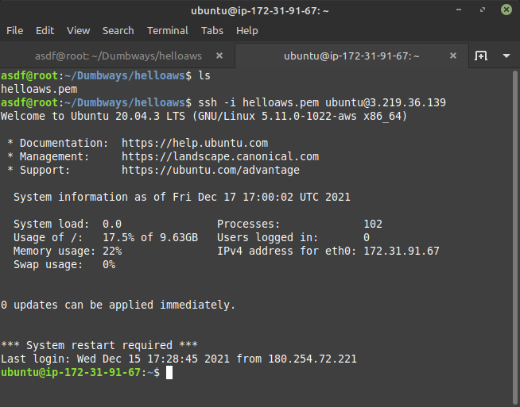

-   Setelah masuk maka lakukan Update dan upgrade `sudo apt update` dan `sudo apt upgrade -y`

    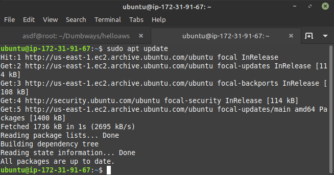

    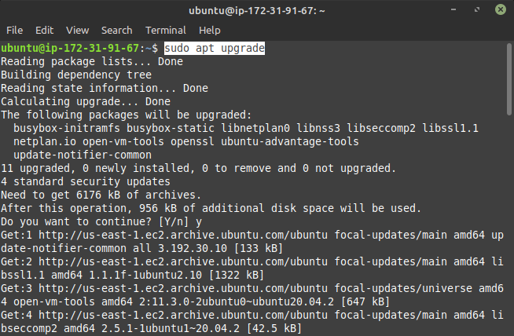

## Install Webserver Nginx

-   Untuk melakukan instal nginx cukup dengan perintah `sudo apt install nginx`

    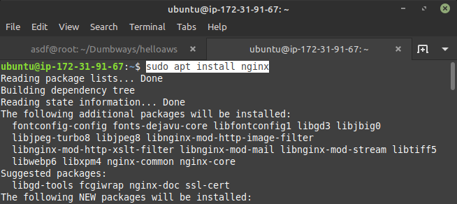

## Reverse proxy aplikasi

-   Selanjutnya buka directory `cd /etc/nginx/` dan buat folder **dumbflix** dengan perintah `sudo mkdir dumbflix`

    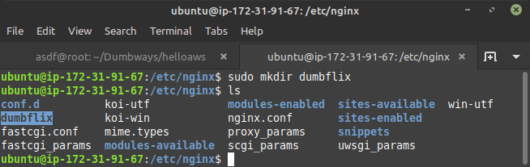

-   Pada folder dumbflix buat file **syarif.onlinecamp.id** dengan perintah `sudo nano syarif.onlinecamp.id`

    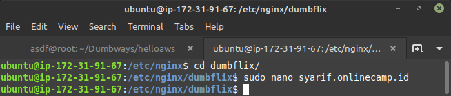

    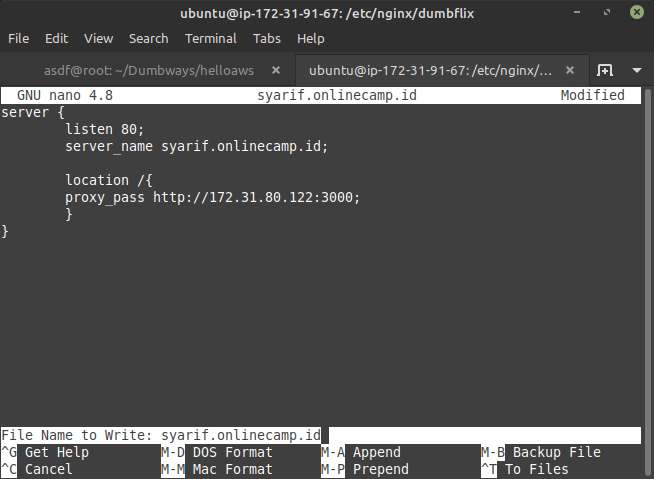

-   Lalu pada directory `cd /etc/nginx` edit file **nginx.conf** lalu tambahkan config `Include /etc/nginx/dumbflix/*;`

    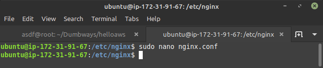

    

-   Cek syntax nginx `sudo nginx -t`

    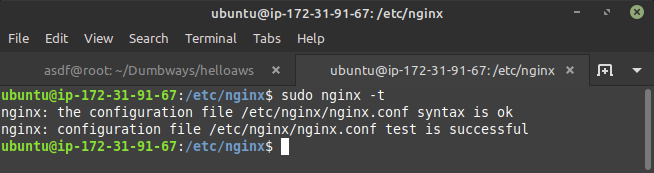

-   Klik `Add record` isi **Type** `A`, isi **Nama** `syarif`, **IPv4 address** `3.219.36.139`dan matikan **Proxy status** lalu `Save`

    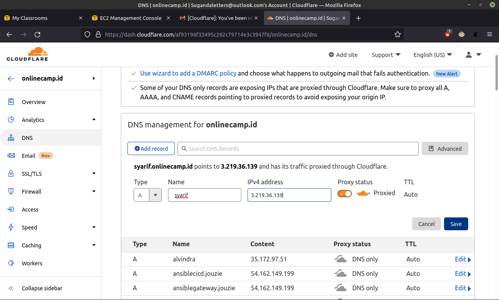

-   Selanjutnya coba restart nginx `sudo systemctl restart nginx.service`

    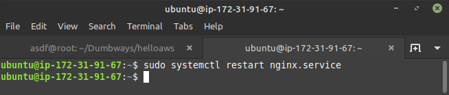

-   ketika sudah melakukan restart maka masukan `syarif.onlinecamp.id` pada web broser

    
