# Install free SSL certificate for web server with let's encrypt

-   Masuk **cloudflare** terlebih dahulu.

    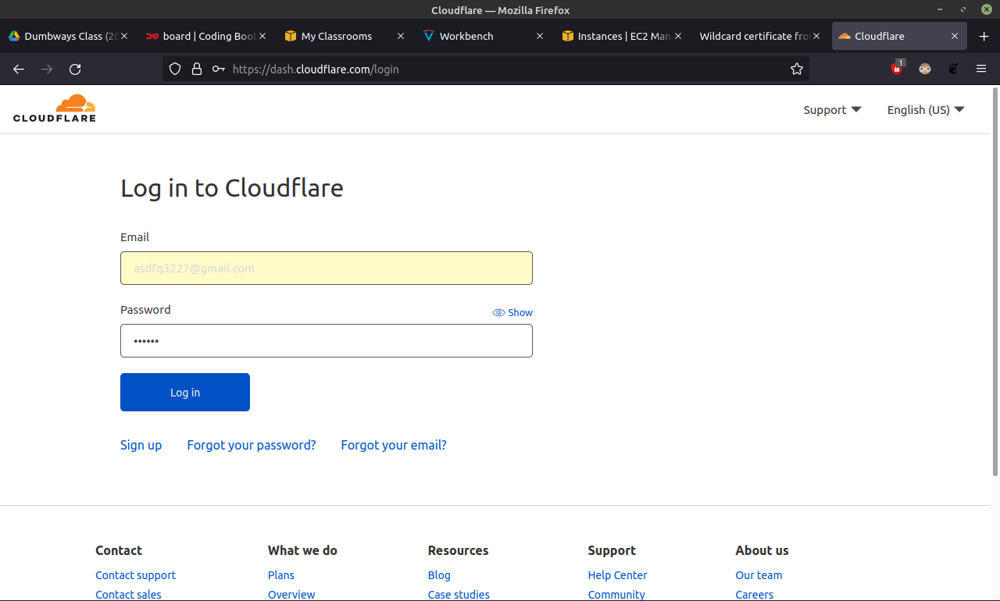

-   Setelah masuk, kunjungi `My Profile` lalu `API Tokens`, pada tabel **API Keys** terdapat `Global API Key` dan klik `View`.

    

-   Jika muncul notifikasi **Your API Key** isi password dan Captha lalu `View`.

    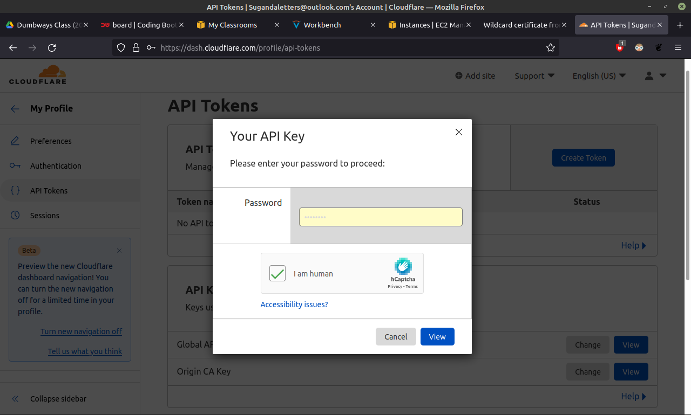

-   Selanjutnya API Key akan keluar, simpan API Key.

    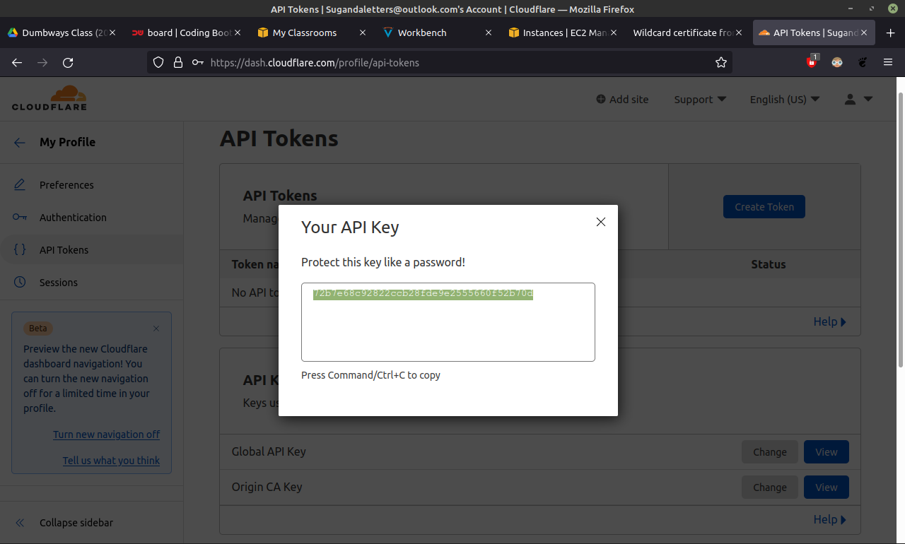

-   Buat directory **.cloudflare** `sudo mkdir .cloudflare`.

    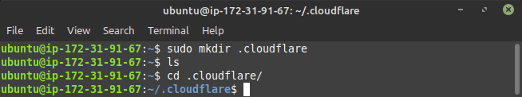

-   Pada directory **.cloudflare** buat file **api.key** `sudo nano api.key`.

    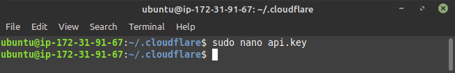

    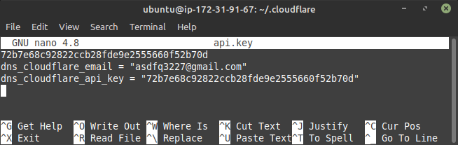

-   Beri akses file **api.key** dengan perintah `sudo chmod 400 api.key`.

    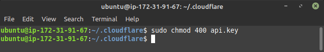

-   Selanjutnya buka `certbot.eff.org` pada pilihan **My HTTP website is running** isi `Nginx` dan `ubuntu20`.

    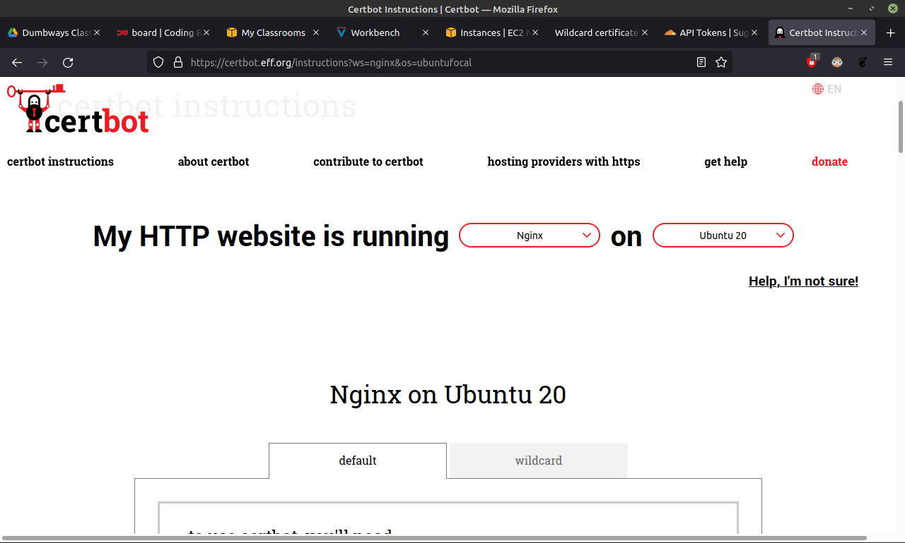

-   Lalu cek snap dengan perintah `sudo snap install core; sudo snap refresh core`.

    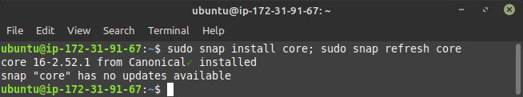

-   Kemudian instal sertbot dengan perintah `sudo snap install --classic certbot`.

    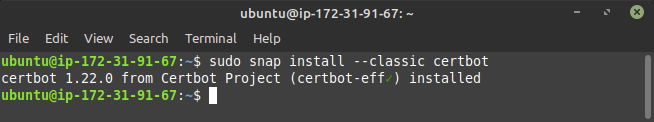

-   Lakukan perintah `sudo ln -s /snap/bin/certbot /usr/bin/certbot` agar menjalankan sertbot tanpa membuka directory **bin**.

    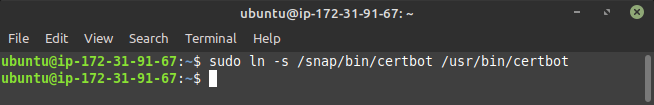

-   Jalankan certbot `sudo certbot`, jika muncul pertanyaan ketik saja `y` dan `n`. lalu pilih `1` karena cuma 1 yang meminta certifikat.

    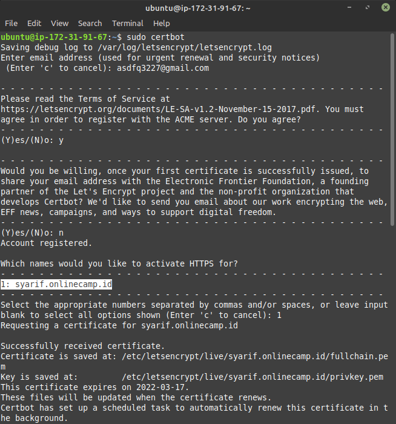

-   Cek file `syarif.onlinecamp.id` pada directory `/etc/nginx/dumbflix/` apakah sudah bersertifikat.

    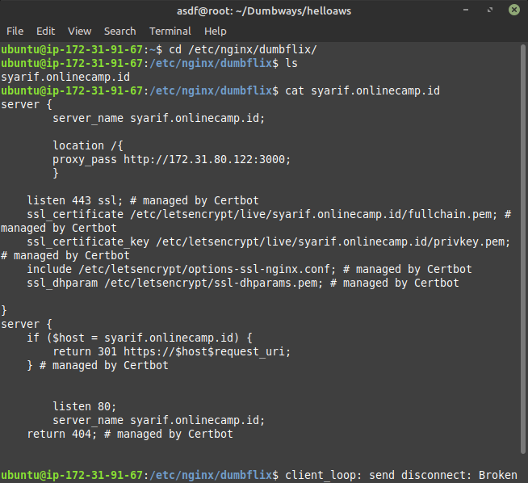

-   Selanjutnya mencoba `https://syarif.onlinecamp.id` pada browser.

    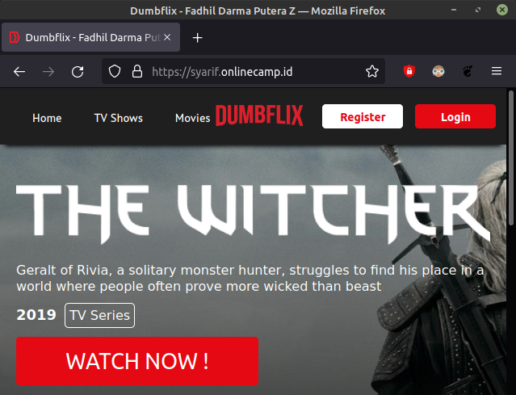
