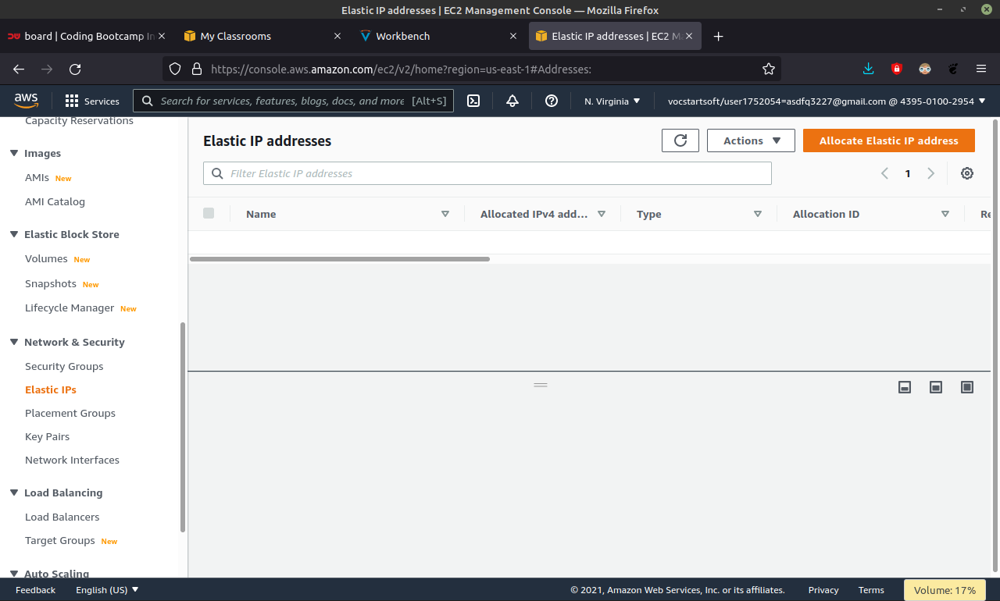

# AWS Create and Setup server

## Server untuk Reverse Proxy

-   Buka awseducate `https://www.awseducate.com/signin/SiteLogin` dan `Sign In`.

    

-   Buka My Classrooms lalu klik `Go to classroom`, jika ada notif Confrim pilih saja `Continue`.

        

    

-   Jika diarahkan pada link `labs.vocareum.com` pilih saja `AWS Console`.

        

-   Jika sudah masuk `console.aws.amazon.com` pada bagian **Build a solution** klik saja `Launch a virtual machine`.

    

-   Pada **Choose an Amazon Machine Images (AMI)** cari **Ubuntu** lalu pilih **Server 20.04 LTS 64-bit x86** dan klik `Select`.

    

-   Pada **Choose an Instance Type** pilih **t2.micro** dan klik `Next: Configure Instance Details`

    

-   Pada **Configure Instance Details** isi `1` pada **Number of Instances** lalu `Disable` pada **Auto-assign Public IP** dan klik `Next: Add Storage`

    

-   Pada **Add Storage** sudah secara default memiliki 8Gb, sesuaikan dengan kebutuhan jika sudah klik `Next: Add Tags`

    

-   Pada **Add Tags** bisa dilewati saja atau klik `Next: Configure Security Group`

    

-   Pada **Configure Security Group** Ijinkan protokol yang ingin dibuka ke publik, karena digunakan untuk reverse proxy maka membuka akses untuk protokol SSH, HTTP, dan HTTPS untuk kebutuhan remote access SSH dan web server. Jika sudah klik `Review and Launch`

    

-   Pada **Review Instance Launch** jika tidak ada yang mau dirubah klik `Launch`

    

-   Pada **Select an existing key pair or create a new key pair** private key yang digunakan untuk login SSH. Masukkan key pair name yang ingin dibuat, dan **Download** Key Pair untuk remot nanti, jika sudah klik `Launch instances`

    

-   Pada **Launch Status** jika **Your instances are now launching** instance berhasil dibuat. klik `View Instances`

    

-   Cek **instances** jika server berhasil dibuat.

    

-   Buka fitur `Elastic IPs` untuk atur ip static, lalu `Allocated Elastic IP address` dan klik `Allocate` .

    

    

-   Selanjutnya klik `Associate this Elastic IP address`.

    

-   Pada **Associate Elastic IP address** pilih server yang telah dibuat, lalu klik `Allocate`.

    

-   Selanjutnya buka directory yang terdapat key pair yang telah didownload, lalu lakukan perintah `sudo ssh -i helloaws.pem ubuntu@3.219.36.139`.

    

-   Ketika sudah berhasil meremote server maka hal pertama yang harus dilakukan adalah `sudo apt update` dan `sudo apt upgrade`.

        

    

## Server untuk Aplikasi

-   Selanjutnya membuat server untuk aplikasi, klik `Launch Instances`.

     

-   Pada kolom pencarian ketik `ubuntu`, ketika muncul pilih **Server 20.04 LTS 64-bit x86** dan klik `Select`

         

-   Pada **Choose an Instance Type** pilih **t2.micro** dan klik `Next: Configure Instance Details`

         

 -   Pada **Configure Instance Details** isi `1` pada **Number of Instances** lalu `Disable` pada **Auto-assign Public IP** dan klik `Next: Add Storage`

     

-   Pada **Add Storage** sudah secara default memiliki 8Gb, sesuaikan dengan kebutuhan jika sudah klik `Next: Add Tags`

     
-   Pada **Add Tags** bisa dilewati saja atau klik `Next: Configure Security Group`

     

-   Pada **Configure Security Group** Ijinkan protokol yang ingin dibuka ke publik, tetapi ini akan membuka pada **All traffic**. Jika sudah klik `Review and Launch`

     

-   Pada **Review Instance Launch** jika tidak ada yang mau dirubah klik `Launch`

     

-   Pada **Select an existing key pair or create a new key pair** untuk kali ini akan menggunakan key pair yang sudah pernah dibuat dan didownload, langsung `Launch instances`

     

-   Pada **Launch Status** jika **Your instances are now launching** instance berhasil dibuat. klik `View Instances`

     

-   Cek **instances** jika server berhasil dibuat.

     

-   Buka fitur `Elastic IPs` untuk atur ip static, lalu `Allocated Elastic IP address` dan klik `Allocate` .

     

     

-   Selanjutnya klik `Actions` lalu pilih `Associate Elastic IP address`.

     

-   Pada **Associate Elastic IP address** pilih server aplikasi yang telah dibuat, lalu klik `Allocate`.

     

-   Cek **instances** jika server aplikasi berhasil dibuat.

     

-   Selanjutnya buka directory yang terdapat key pair, lalu lakukan perintah remote `sudo ssh -i helloaws.pem ubuntu@3.223.87.14` jika terjadi **Permission denied (publickey)** maka lakukan perintah `sudo chmod 400 helloaws.pem`, selanjutnya **ulangi** perintah remote.

     

-   Ketika sudah berhasil meremote server maka hal pertama yang harus dilakukan adalah `sudo apt update && sudo apt upgrade -y`.

         

-   Lakukan perintah `git clone https://github.com/sgnd/dumbflix-frontend` yaitu untuk mendapatkan aplikasi yang akan dideploy

     

-   Lalu instal node.js 14.x `curl -o- https://raw.githubusercontent.com/nvm-sh/nvm/v0.39.0/install.sh | bash`

     

-   Setelah itu lakukan perintah `exec bash`, lalu cek versi yang sudah terinstal dengan printah `nvm -v`

     

-   Untuk menginstal nodejs lakukan perintah `nvm install 14`

     

-   Cek versi menggunakan perintah `node -v` Untuk mengecek npm gunakan perintah `npm -v`

     

-   Ketika sudah mengclone aplikasi maka pindah pada directory `cd dumbflix-frontend`

     

-   Pada directory dumbflix-frontend lakukan perintah `npm install`

     

-   lalu ketik perintah `npm start`

     

     

-   ketika sudah melakukan start maka masukan `3.223.87.14:3000` pada web broser

     

## Cabut Ip Public

-   Buka fitur `Elastic IPs` lalu pilih server yang akan dicabut ip publiknya, jika sudah terpilih klik `Actions` lalu pilih `Disassociate Elastic IP address`.

     

     

-   Selanjutnya klik `Disassociate`.

     

-   Pada tabel **Security** lalu klik ID pada **Security groups**.

     

-   Selanjutnya klik `Edit inbound rules`.

     

-   Pada tabel **Edit inbound rules** lalu pada **Type** pilih `All traffic` pada Source pilih `Anywhere-IPv4`, kemudian klik `Save rules`.

     
        
-   Selanjutnya cek **Instances** apakah masih terdapat Ip Public.

     
