# VMWARE - SERVER FOR APPLICATION

## Update and upgrade system opration

-   Masuk pada server yang telah diuat `ssh asdf@192.186.1.17`

    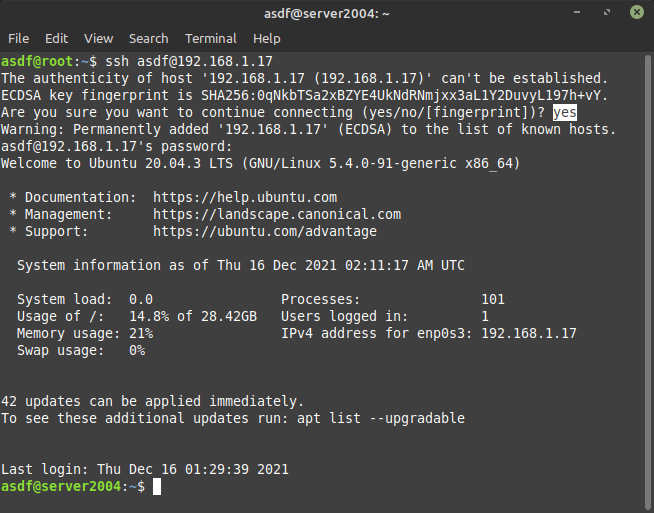

-   Setelah masuk maka lakukan Update dan upgrade `sudo apt update && apt upgrade -y`

    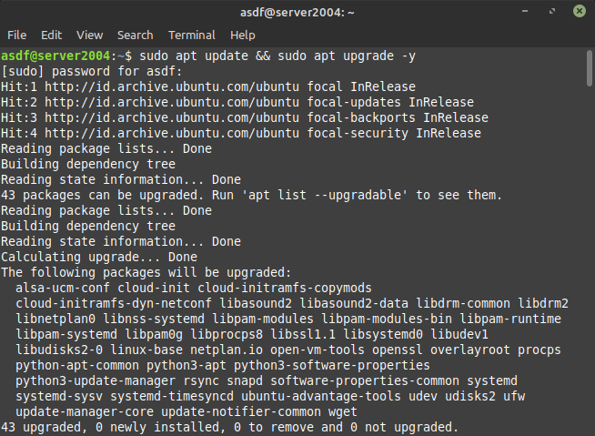

## Install node.js 14/xx

-   Setelah melakukan Update dan upgrade lalu instal node.js 14.x `curl -o- https://raw.githubusercontent.com/nvm-sh/nvm/v0.39.0/install.sh | bash`

    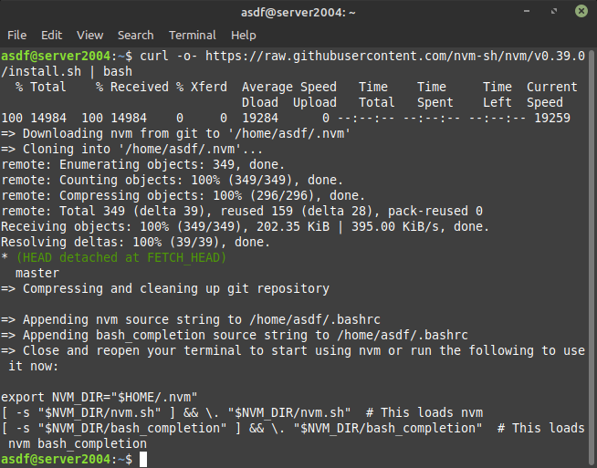

-   Setelah itu lakukan perintah `exec bash`, lalu cek versi yang sudah terinstal dengan printah `nvm -v`

    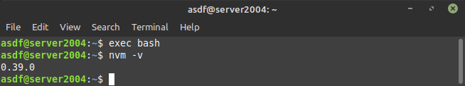

-   Untuk menginstal nodejs lakukan perintah `nvm install 14`

    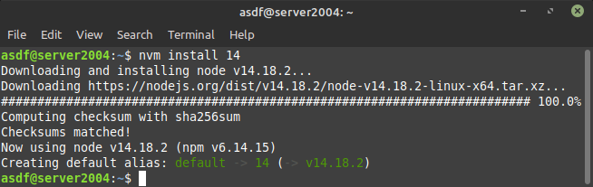

-   Cek versi menggunakan perintah `node -v` Untuk mengecek npm gunakan perintah `npm -v`

    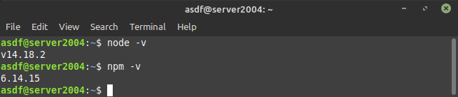

## gitclone sebuah apps

-   Lakukan perintah `git clone https://github.com/sgnd/dumbflix-frontend` yaitu untuk mendapatkan aplikasi yang akan dideploy

    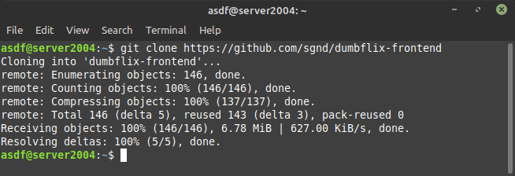

## Change directory and deploy application

-   Ketika sudah mengclone aplikasi maka pindah pada directory `cd dumbflix-frontend`

    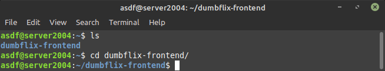

-   Pada directory dumbflix-frontend lakukan perintah `npm install`

    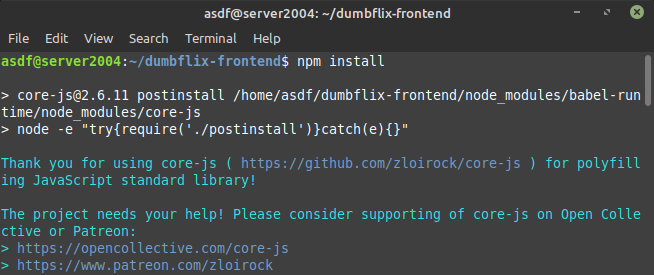

-   lalu ketik perintah `npm start`

    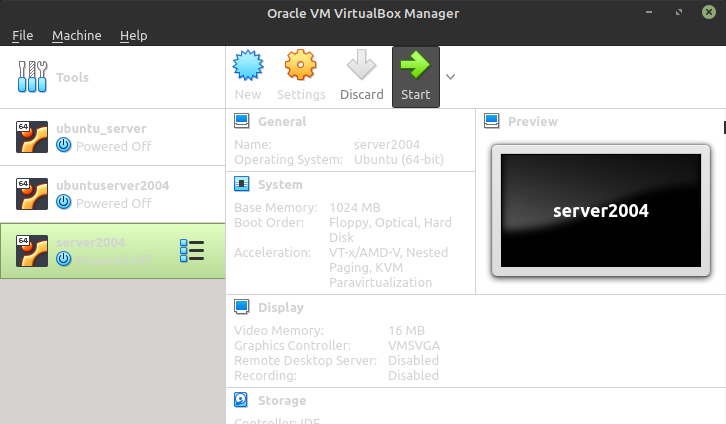

-   ketika sudah melakukan start maka masukan `192.168.1.17:3000` pada web browser

    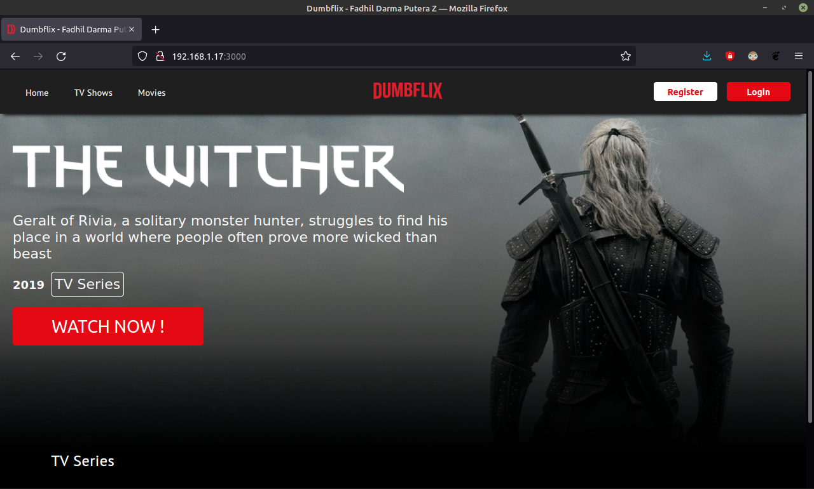
