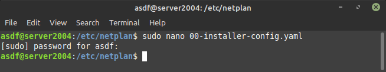

# VMWARE - Setup Network

## Change network from NAT to Bridge

-   Buka mesin virtual (VirtualBox) arahkan pada Server yang ingin dirubah tipe jaringannya lalu klik `Setting`

    

-   Setelah masuk pada tab **Network** jika ingin mengganti tipe jaringan maka klik pada bagian **Attached to:** rubah yang semula tipe jaringannya **NAT** menjadi **Bridge Adapter** kemudian `OK`

    

## Setup static IP for Ubuntu Server

-   Selanjutnya ketika sudah berada dalam server lakukan perintah `ifconfig` untuk melihat IP yang sedang digunakan.

    

-   Akses directory `cd /etc/netplan/`

    

-   Edit file yang berada dalam directory **netplan** `sudo nano nama.file`, lakukan perubahan angka terakhir dari IP address sesuai keinginan kemudian pada **nameservers** isikan saja dns google `8.8.8.8`

    

    

-   Jika sudah melakukan perubahan lakukan perintah `sudo netplan apply`

    

-   Terakhir cek koneksi internet dengan melakukan perintah `ping google.com`

    
