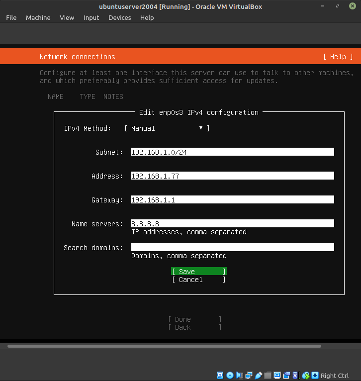
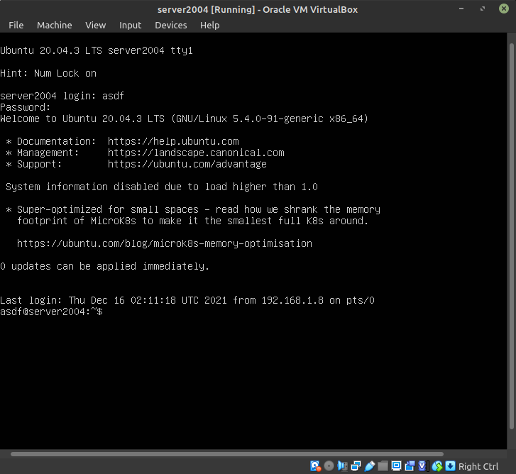

# Vmware Install Ubuntu

-   Persiapan

    - Download Ubuntu Server 20.04.x LTS `https://releases.ubuntu.com/focal/`

    - Download VirtualBox for Linux `https://www.virtualbox.org/wiki/Linux_Downloads`

    - **Virtualization Technology** sudah diaktifkan atau berstatus **enabled** pada **Bios**

-   VirtualBox

    Buka VirtualBox lalu klik `New`

    

-   Setelah itu akan tampil Window **Name and oprating system**, pada bagian **Name** isi dengan `ubuntu server` maka secara otomatis pada bagian **Type** dan **Version** akan mengisi dengan sendirinya, lalu klik `Next >`

    

-   Langkah selanjutnya tentukan besar ukuran memory yang akan kita gunakan. Minimal system requirements sistem operasi ubuntu yaitu **1024 MB** atau setara dengan **1 GB**. Jika dirasa kurang bisa menambah besarnya ukuran memory ini. lalu `Next >`

    

-   Hardisk yang akan gunakan disini akan membuat hardisk virtual baru. pilih **Creat a virtual hard disk now** lalu klik `Creat`

    

-   Pada **Hard disk file type** pilih **VDI (VirtualBox Disk Image)** lalu `Next >`

    

-   Pada **Storage on physical hard disk** pilih **Dynamically allocated** lalu `Next >`

    

-   Di tahap **File location and size** menentukan besarnya virtual hardisk yang akan kita buat. Disini saya menentukan virtual hardisknya sebesar `30 GB`. virtual hardisk bisa diisi sesuai kebutuhan. lalu `Create`

    

-   Setelah di `Create` maka sudah selesai melakukan pembuatan virtual mesin, selanjutnya klik `settings` untuk melakukan konfigurasi lainnya.

    

-   Pada **tab system** tentukan core prosesor yang akan digunakan dalam virtual mesin ini. Secara default mesin virtual hanya menggunakan **1 core**.  sebenarnya bisa optional karna untuk belajar jadi menggunakan 1 core sudah cukup.

    

-   Selanjutnya pada **tab storage** `add` **iso** ubuntu yang sudah didownload.

    

-   pada **tab Network** di bagian **Attached** untuk mengganti mode jaringan dari mode NAT ke Bridge yang nantinya agar host dan mesin virtual kita bisa berada dalam satu network yang sama. lalu klik `OK`

    

-   Setelah mesin virtual sudah selesai dibuat selanjutnya kita mulai menyalakan mesin virtual dengan klik `Start`.

    

-   Tunggu hingga proses load selesai maka nanti akan tampilan halaman installer. Pilih bahasa instalasi yang diinginkan.

    

-   Selanjutnya kita diminta untuk melakukan konfigurasi keyboard layout. Biarkan default saja dan pilih `Done` untuk lanjut.

    

-   Pada tahap Network Conections , pilih **IPv4 Method** dan Manual

    

-   Lalu isi configuration, klik `Save`

    

-   Untuk Proxy Address kosongkan saja.

    

-   Untuk Mirror Address biarkan default saja.

    

-   Untuk opsi storage pilih custom storage layout.

    

-   Pada **AVAILLABLE DEVICE** pilih **Add GPT Partition**.

    

-   Pada **Size** isi **1G** lalu pada **Format** isi **swap**,klik `Creat`.

    

-   lalu **AVAILLABLE DEVICE** pilih **Add GPT Partition**.

    

-   Pada **Size** isi sisa storage lalu pada **Format** isi **ext4**,klik `Creat`.

    

-   Jika sudah maka **Enter** pada `Done` dan **Continue**.

    

-   Maka selanjutnya membuat akun yang nantinya digunakan untuk masuk kedalam sistem operasi ubuntu server yang telah terinstall. Isi sesuaikan dengan keinginan.

    

-   Selanjutnya akan ada tawaran untuk langsung melakukan instalasi **OpenSSH Server** yang bisa kita gunakan untuk remote server nantinya. **Enter** pada **Install OpenSSH server**, lalu `Done`.

    

-   Tunggu proses instalasi ubuntu server hingga selesai. Jika sudah maka nantinya kita diminta untuk melakukan `reboot` untuk kemudian booting masuk ke sistem operasi yang telah terinstall.

    

-   Tungu proses booting selesai hingga muncul prompt login masuk sistem operasi. Jika sudah ada prompt untuk masuk ke sistem operasi masukan **username** dan **password** yang telah dibuat saat instalasi.

    

-   Jika sudah masuk lakukan perintah `ping google.com` untuk mencoba apakah terhubung dengan internet atau tidak.

        
