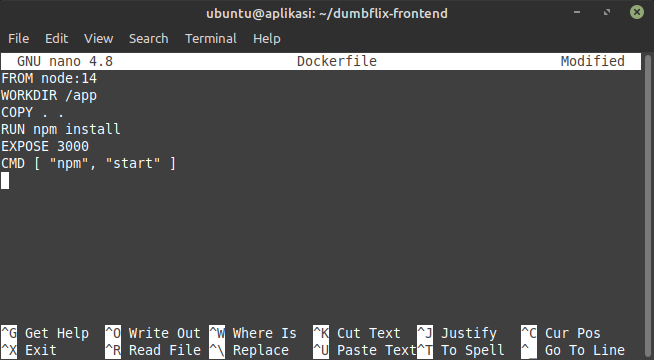
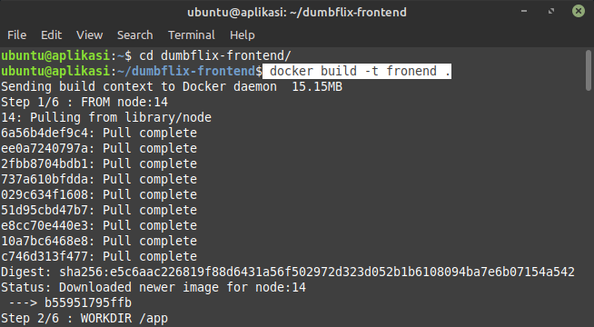
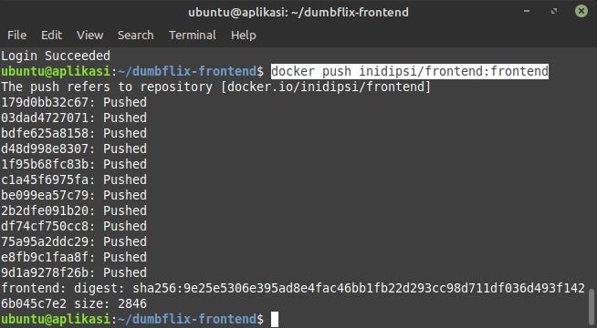
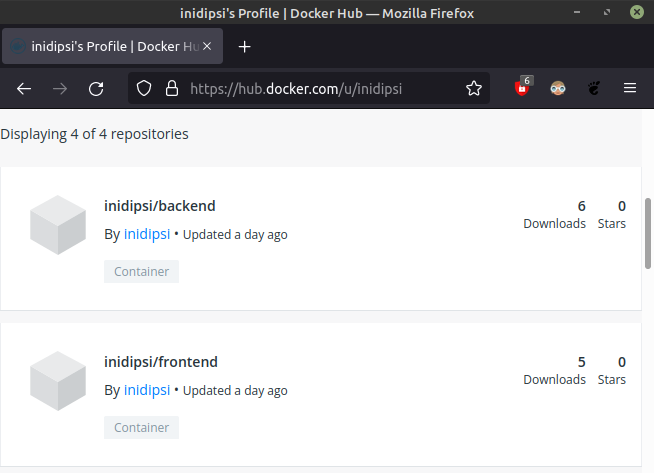

# Create Docker Images

## Membuat Docker Images Untuk Frontend dan backend

-   Login ke server frontend dan backend.

-   Pada directory `dumbflix-frontend` dan `dumbflix-backend` masing-masing buat file Dockerfile.
    ```sh
    sudo nano Dockerfile
    ```
-   Isi Dockerfile konfigurasi.
    ```sh
    FROM node:14
    WORKDIR /app
    COPY . .
    RUN npm install
    EXPOSE 3000
    CMD [ "npm","start" ]
    ```
    >rubah "EXPOSE 3000" untuk frontend dan "EXPOSE 5000" untuk backend

    

-   jika sudah, build images dari Dockerfile yang sudah kita buat dengan perintah.
    ```sh
    docker build -t frontend .
    ```
    

-   selanjutnya, push images yang sudah kita build.
    ```sh
    sudo docker push <username>/<images-name>:<images-tag>
    ```
    

-   Buka halaman web docker hub untuk melihat images yang sudah kita push pada repository kita

    
