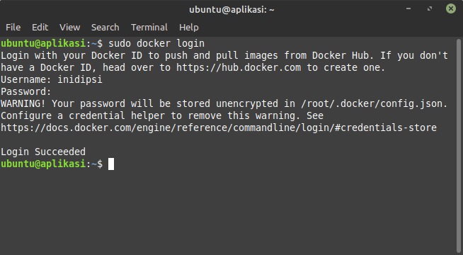

# Install Docker

## Install docker in server front-end and server back-end

-   Update dan upgrade sistem dan install packages menggunakan repo.
  ```sh
  sudo apt-get update

 sudo apt-get install \
    ca-certificates \
    curl \
    gnupg \
    lsb-release
    ```
    

-   Selanjutnya tambahkan official Docker GPG key.
    ```sh
    curl -fsSL https://download.docker.com/linux/ubuntu/gpg | sudo gpg --dearmor -o /usr/share/keyrings/docker-archive-keyring.gpg
    ```
-   Selanjutnya tambahkan repo stable instalasi docker.
    ```sh
    echo \
    "deb [arch=$(dpkg --print-architecture) signed-by=/usr/share/keyrings/docker-archive-keyring.gpg] https://download.docker.com/linux/ubuntu \
    $(lsb_release -cs) stable" | sudo tee /etc/apt/sources.list.d/docker.list > /dev/null
    ```
    

-   update lagi system dan instal `docker-ce docker-ce-cli` dan `containerd.io`
    ```sh
    sudo apt-get update
    sudo apt-get install docker-ce docker-ce-cli containerd.io
    ```
    

-   Silakan daftar / sign up.
    ```sh
    https://hub.docker.com/
    ```
    

-   login docker menggunakan akun hub docker yang telah dibuat sebelumnya.
    ```sh
    docker login
    ```
    
