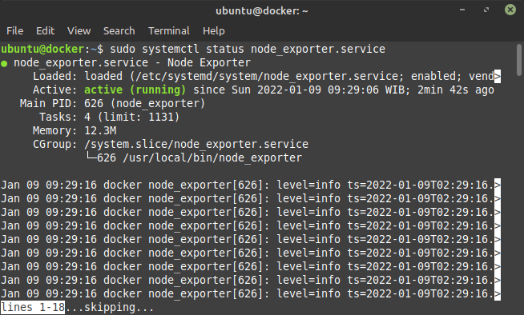
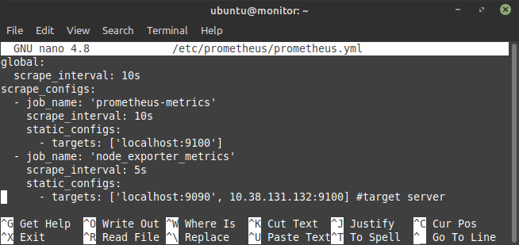
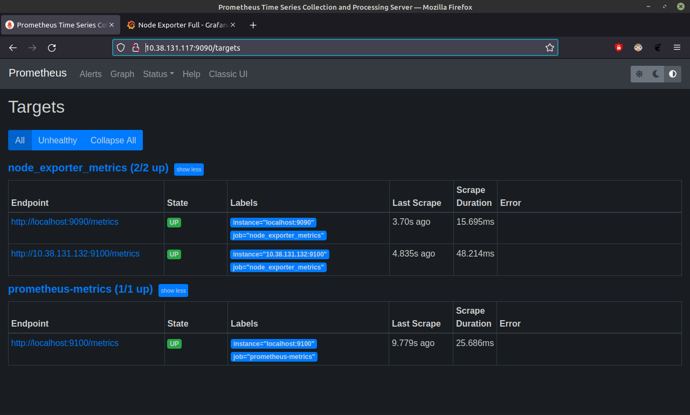
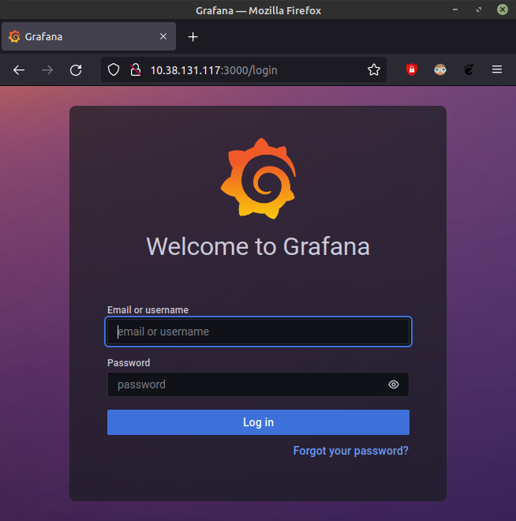
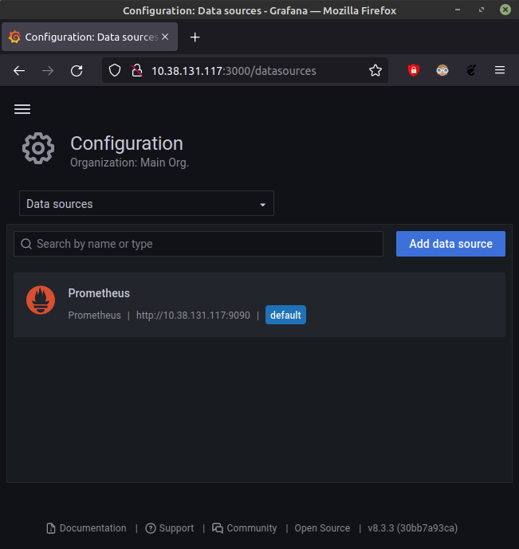
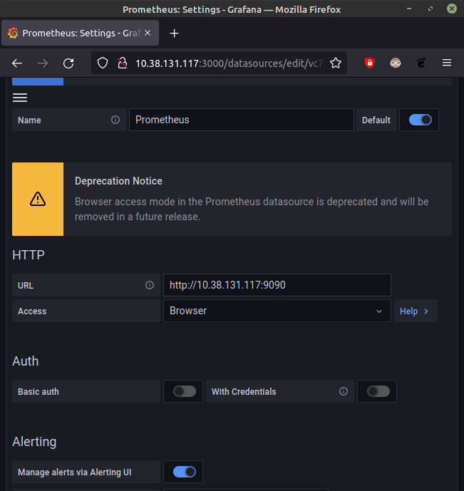
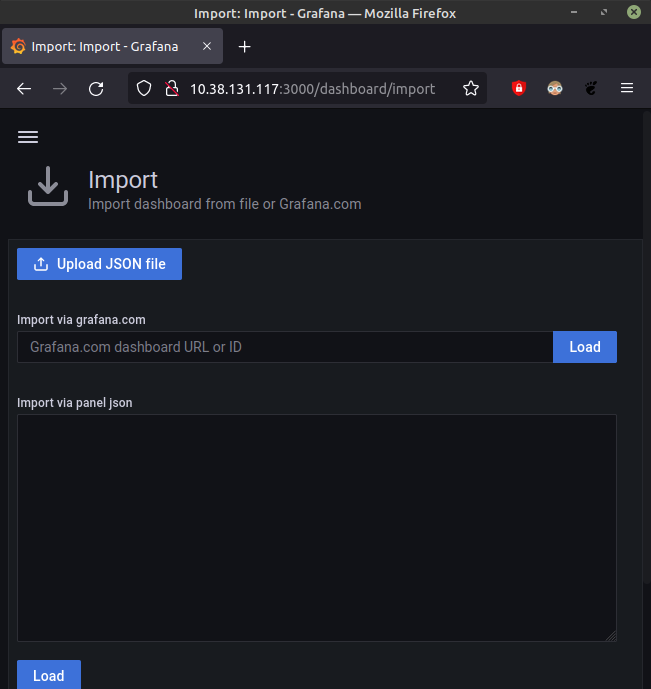
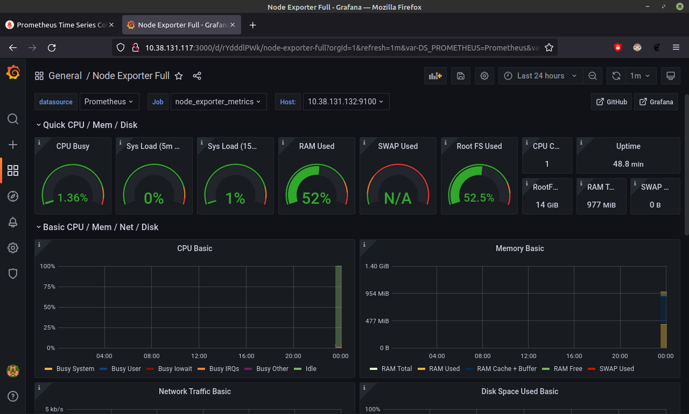

# Connect Multiple Server to Prometheus

## Setup node exporter

-   Install node_exporter di server target

    

-   Edit file prometheus.yml 
    ```sh
    sudo nano /etc/prometheus/prometheus.ym
    ```
    ```sh
    global:
      scrape_interval: 10s
    scrape_configs:
      - job_name: 'prometheus-metrics'
        scrape_interval: 10s
        static_configs:
          - targets: ['localhost:9100']
      - job_name: 'node_exporter_metrics'
        scrape_interval: 5s
        static_configs:
          - targets: ['localhost:9090', 44.198.105.77:9100] #target server
    ```
    

-   Restart prometheus service
    ```sh
    sudo systemctl restart prometheus.service
    ```
-   Masuk ke server promtheus dengan port 9090

    

## Setup Grafana

-   Lakukan login pada grafana

    

-   Lalu tambahkan data source prometheus
    ```sh
    alamatIP:3000/datasource
    ```
    

-   Lalu setup prometheus pada web grafana. Dengan menambahkan URL dari prometheus. pastikan tidak terdapat warning atau failed.

    

-   cari dashboard yang sesuai kebutuhan pada `https://grafana.com/grafana/dashboards/`

    

-   Selanjutnya pada **dashboard** pilih `prometheus`, pada **Job** masukan `node_exporter_metrics` dan pada **Host** pilih `IP target`.

    
