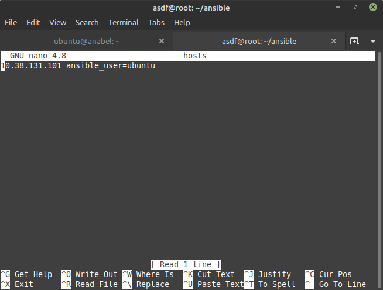
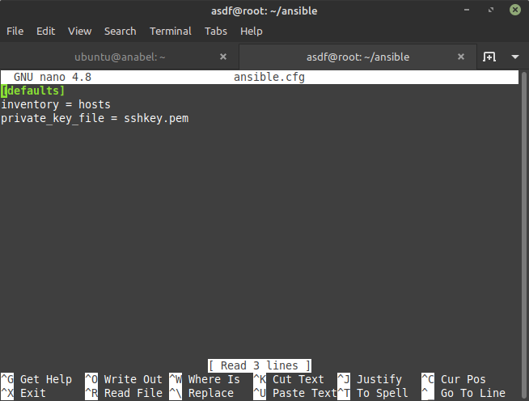
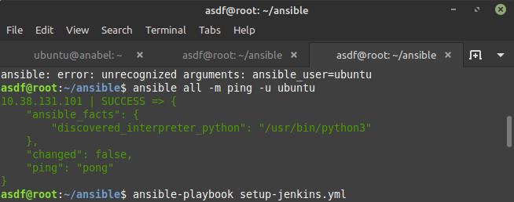
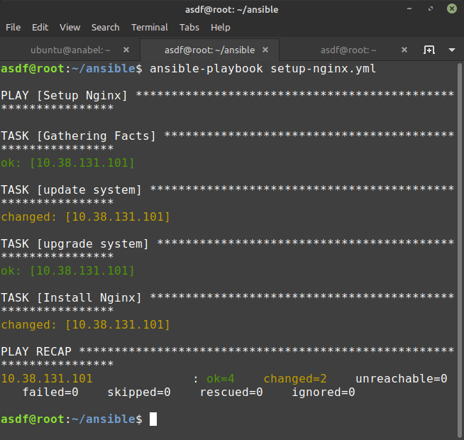
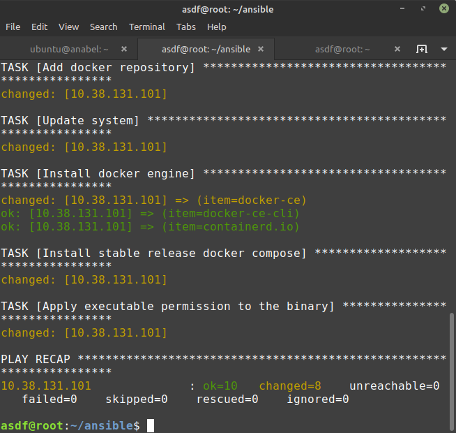
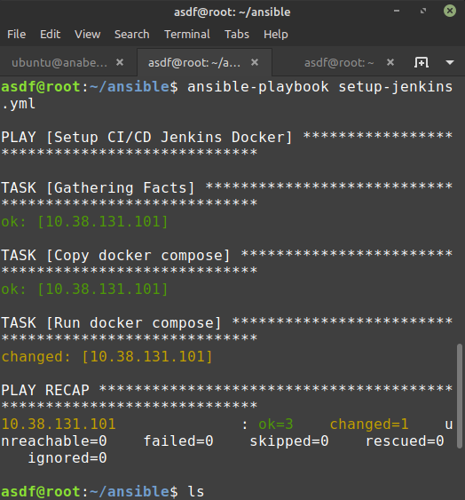
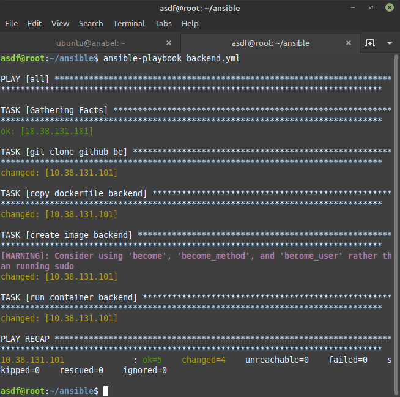

# Create Ansible Config

## Setup Server With Ansible

-   konfigurasi PPA
    ```sh
    sudo apt update
    ```
    ```sh
    sudo apt install software-properties-common
    ```
    ```sh
    sudo add-apt-repository --yes --update ppa:ansible/ansible
    ```
-   kemudian install apt ansible
    ```sh
    sudo apt install ansible
    ```
-   Buat directory ansible dan buat hosts untuk menyimpan konfigurasi host

    

-   Buat file ansible.cfg di work directory

    

-   kemudian cek ping

    

-   Siapkan konfigurasi untuk nginx dan kemudian jalankan
    ```sh
    ---
    - name: Setup Nginx
      hosts: all
      become: true
      tasks:
        - name: update system
          apt:
            update_cache: yes
        - name: upgrade system
          apt:
            upgrade: dist
        - name: Install Nginx
          apt:
            name: nginx
            state: present
            update_cache: yes
    ```
    ```sh
    ansible-playbook nginx.yml
    ```
    

-   Buat file setup-docker.yml
    ```sh
    ---
    - name: Setup Docker & Docker Compose
      hosts: all
      become: true
      tasks:
      - name: Update system
        apt:
          update_cache: yes
      - name: Upgrade system
        apt:
          upgrade: dist

      - name: Setup repository
        shell: "sudo apt-get install ca-certificates curl gnupg lsb-release"
        args:
          executable: /bin/bash

      - name: Add docker GPG key
        apt_key:
          url: https://download.docker.com/linux/ubuntu/gpg
          state: present

      - name: Add docker repository
        apt_repository:
          repo: deb https://download.docker.com/linux/ubuntu focal stable
          state: present

      - name: Update system
        apt:
          update_cache: yes

      - name: Install docker engine
        apt:
          name: "{{item}}"
          state: latest
          update_cache: yes
        loop:
          - docker-ce
          - docker-ce-cli
          - containerd.io

      - name: Install stable release docker compose
        shell: sudo curl -L "https://github.com/docker/compose/releases/download/1.29.2/docker-compose-$(uname -s)-$(uname -m)" -o /usr/local/bin/docker-compose
        args:
          executable: /bin/bash

      - name: Apply executable permission to the binary
        shell: "sudo chmod +x /usr/local/bin/docker-compose"
        args:
          executable: /bin/bash
    ```
    jalankan
    ```sh
    ansible-playbook setup-docker.yml
    ```
    

-   Siapkan konfigurasi untuk jenkins dan Buat folder `docker-jenkins` berisi file `docker-compose.yml`
    ```sh
    version: '3.9'
    services:
      jenkins:
        image: jenkins/jenkins:lts-jdk11
        ports:
          - 8080:8080
          - 50000:50000
        privileged: true
        user: root
        container_name: jenkins
        volumes:
          - ~/jenkins:/var/jenkins_home
          - /var/run/docker.sock:/var/run/docker.sock
          - /usr/local/bin/docker:/usr/local/bin/docker   
    ```
-   Lalu buat file yml untuk setup jenkinsnya `setup-jenkins.yml`
    ```sh
    ---
    - name: Setup CI/CD Jenkins Docker
      hosts: all
      become: true
      tasks:
        - name: Copy docker compose
          copy:
            src: docker-jenkins/docker-compose.yml
            dest: /home/ubuntu/

        - name: Run docker compose
          shell: "docker-compose up -d"
          args:
            executable: /bin/bash
    ```
    lalu Jalankan
    ```sh
    ansible-playbook setup-jenkins.yml
    ```
    

-   siapkan konfigurasi untuk backend dengan membuat file `setup-backend.yml`
    ```sh
    - hosts: all
      become: true
      become_user: ubuntu
      gather_facts: yes
      tasks:
    - name: git clone github be
      command: "chdir=/home/ubuntu/ git clone https://github.com/asdfroot/dumbflix-backend.git"
    - name: copy dockerfile backend
      copy:
       src: backend/Dockerfile
       dest: /home/ubuntu/dumbflix-backend
    - name: create image backend
      command: "chdir=/home/ubuntu/dumbflix-backend sudo docker build -t backend1 ."
    - name: run container backend
      command: "sudo docker run -itd -p 5000:5000 --name backend1 backend1"
    ```
    Buat folder `backend` berisi `Dockerfile`
    ```sh
    FROM node:10
    WORKDIR /app
    COPY . .
    RUN npm install
    EXPOSE 5000
    CMD ["npm", "start"]
    ```
    jalankan
    ```sh
    ansible-playbook backend.yml
    ```
    
