# Setup Monitoring Server

## Install Node Exporter di server

-   Masuk ke server dan lakukan Update pada server

-   Mendownload file node exporter
    ```sh
    wget https://github.com/prometheus/node_exporter/releases/download/v1.2.2/node_exporter-1.2.2.linux-amd64.tar.gz
    ```
    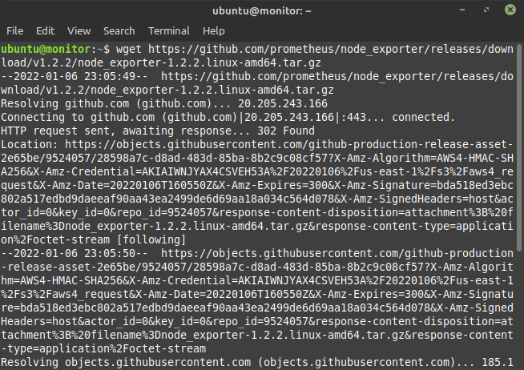

-   Lalu mengextract file yang sudah didownload tadi
    ```sh
    tar xvfz node_exporter-1.2.2.linux-amd64.tar.gz
    ```
    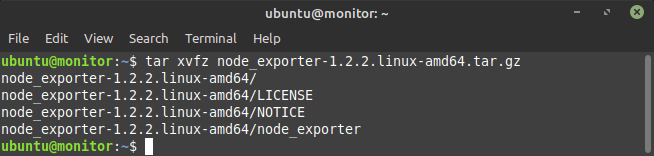

-   Pindahkan file hasil extract ke /usr/local/bin
    ```sh
    sudo mv node_exporter-1.2.2.linux-amd64 /usr/local/bin
    ```
    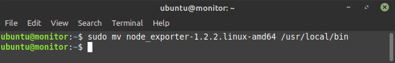

-   Tambahkan user untuk node_exporter
    ```sh
    sudo useradd -rs /bin/false node_exporter
    ```
    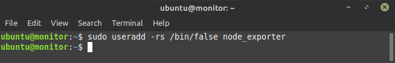

-   Lalu buat file node_exporter.service di /etc/systemd/system/
    ```sh
    [Unit]
    Description=Node Exporter
    After=network.target
    [Service]
    User=node_exporter
    Group=node_exporter
    Type=simple
    ExecStart=/usr/local/bin/node_exporter
    [Install]
    WantedBy=multi-user.target
    ```
    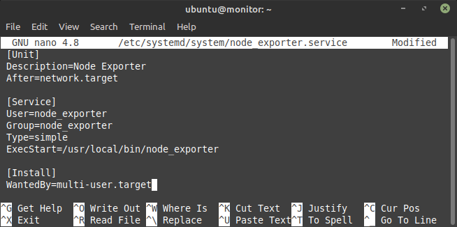

-   Selanjutnya jalankan service node_exporter
    ```sh
    sudo systemctl daemon-reload
    ```
    ```sh
    sudo systemctl enable node_exporter
    ```
    ```sh
    sudo systemctl start node_exporter
    ```
    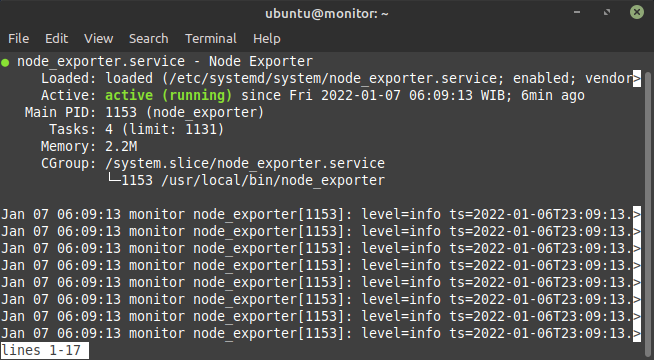

-   Buka web browser dan akses di `http://alamatIP:9100`

    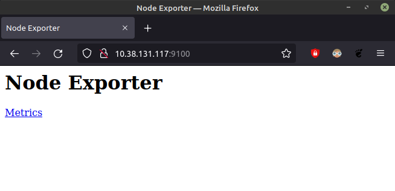

## Install Prometheus di server

-   Mendownload file node Prometheus
    ```sh
    wget https://github.com/prometheus/prometheus/releases/download/v2.31.1/prometheus-2.31.1.linux-amd64.tar.gz
    ```
    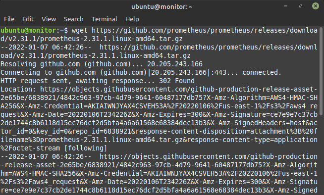

-   Lalu mengextract file yang sudah didownload tadi
    ```sh
    tar -xf prometheus-2.31.1.linux-amd64.tar.gz
    ```
    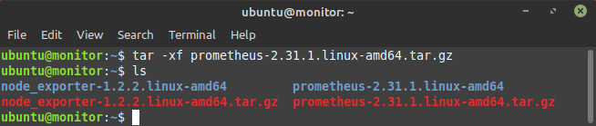

-   Pindahkan file hasil extract ke /usr/local/bin
    ```sh
    sudo mv prometheus promtool /usr/local/bin
    ```
    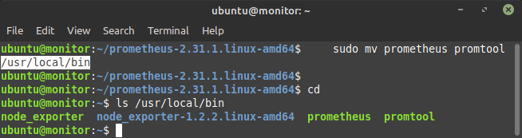

-   Lalu buat folder prometheus pada /etc/ dan pada /var/lib/
    ```sh
    sudo mkdir /etc/prometheus /var/lib/prometheus
    ```
    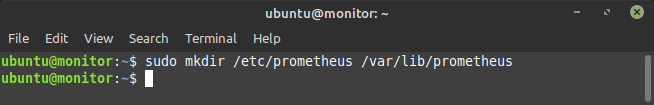

-   Setelah itu pindahkan folder /console_libraries/ yang ada di folder hasil ekstraksi ke /etc/prometheus/
    ```sh
    sudo mv consoles console_libraries /etc/prometheus
    ```
    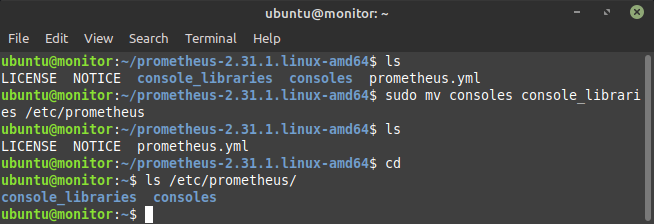

-   Selanjutnya membuat file configurasi prometheus, dengan nama prometheus.yml, dan memberikan detail job yang akan dilakukan, dan server yang akan di monitor.
    ```sh
    global:
      scrape_interval: 10s
    scrape_configs:
      - job_name: 'prometheus-metrics'
        scrape_interval: 10s
        static_configs:
          - targets: ['localhost:9100']
    - job_name: 'node_exporter_metrics'
      scrape_interval: 5s
      static_configs:
        - targets: ['44.198.105.77:9100'] #target server
    ```
    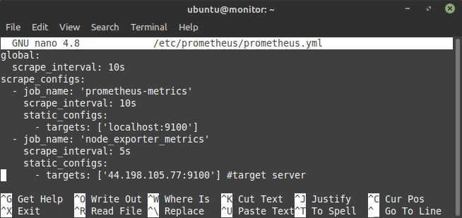

-   Tambahkan user untuk prometheus dan ubah kepemilikan folder /etc/prometheus dan /var/lib/prometheus ke user prometheus
    ```sh
    sudo useradd -rs /bin/false prometheus
    ```
    ```sh
    sudo chown -R prometheus: /etc/prometheus /var/lib/prometheus
    ```
    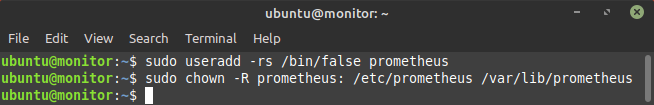

-   Lalu tambahkan file prometheus.service di /etc/systemd/system/, dengan isinya sebagai berikut.
    ```sh
    [Unit]
    Description=Prometheus
    After=network.target
    [Service]
    User=prometheus   
    Group=prometheus   
    Type=simple
    ExecStart=/usr/local/bin/prometheus \
        --config.file /etc/prometheus/prometheus.yml \
        --storage.tsdb.path /var/lib/prometheus/ \
        --web.console.templates=/etc/prometheus/consoles \
        --web.console.libraries=/etc/prometheus/console_libraries
    [Install]
    WantedBy=multi-user.target
    ```
    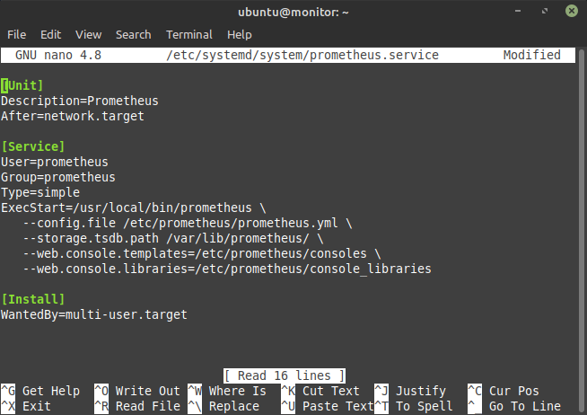

-   Jalankan service prometheus Melakukan test akses ke prometheus dengan
    ```sh
    sudo systemctl daemon-reload
    ```
    ```sh
    sudo systemctl enable prometheus
    ```
    ```sh
    sudo systemctl start prometheus
    ```
    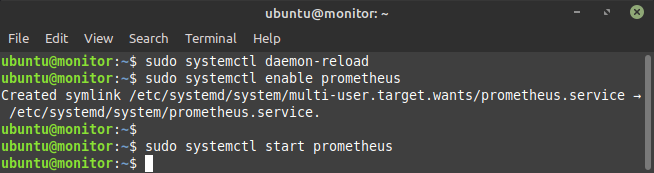

-   Melakukan test akses ke prometheus

    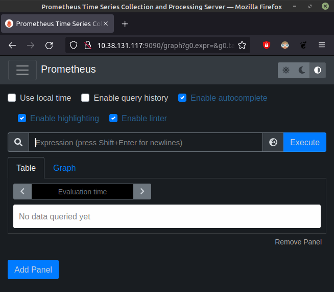

## Install Grafana di server

-   Download gpg.key untuk package grafana, tambahkan ke apt dan repository grafana
    ```sh
    wget -q -O - https://packages.grafana.com/gpg.key | sudo apt-key add -
    echo "deb https://packages.grafana.com/oss/deb stable main" | sudo tee -a /etc/apt/sources.list.d/grafana.list
    ```
-   Update dengan perintah `sudo apt-get update` lalu install grafana
    ```sh
    sudo apt-get install grafana
    ```
    

-   Jalankan service grafana
    ```sh
    systemctl enable grafana-server
    ```
    ```sh
    systemctl restart grafana-server.service
    ```
    ```sh
    systemctl status grafana-server.service
    ```
    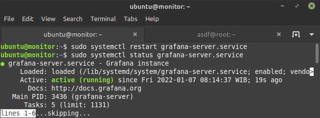

-   Lalu rubah config file grafana, `allow_sign_up` dan `auth.anonymous` dibuat **false**.
    ```sh
    sudo nano /etc/grafana/grafana.ini
    ```
    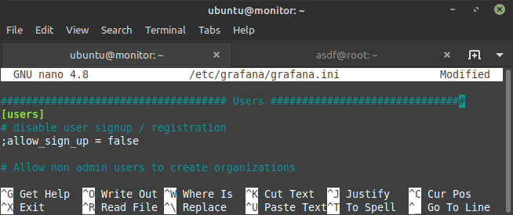

-   Restart service grafana
    ```sh
    systemctl restart grafana-server.service
    ```
-   Lalu akses ip server monitor melalui port `3000`

    

    
